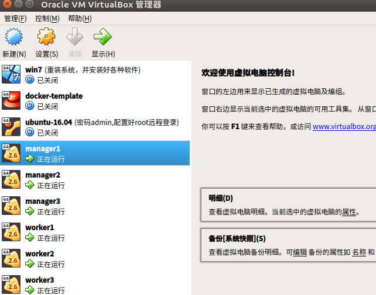
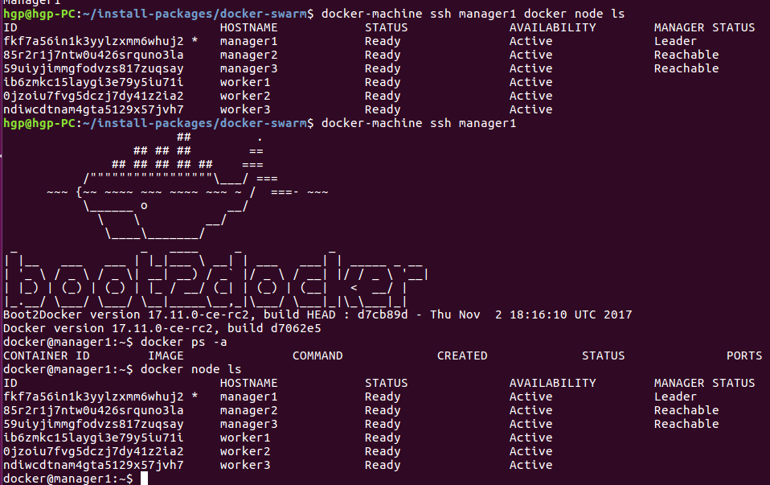

# docker-machine创建docker-swarm集群

### 重要的前提条件，这些软件没安装好，后面的步骤无法进行
* 1) 安装好virtualbox虚拟机
* 2) docker-ce(版本号必须大于1.12版本)
* 3) docker-machine(是可执行的单个二进制文件，下载后直接放到环境变量路径就可以了)

[centos7系统的docker-ce的下载安装介绍](../安装/Centos7通过安装包安装docker.md)  
[ubuntu16.04系统的docker-ce的安装介绍](../安装/Ubuntu16.04通过安装包安装docker.md)  
[docker-machine的阿里云下载地址https://mirrors.aliyun.com/docker-toolbox/linux/machine/](https://mirrors.aliyun.com/docker-toolbox/linux/machine/)  
 
#### docker-machine的下载安装，直接把下载的单个二进制文件重命名放到环境路径中去
```
curl -L https://mirrors.aliyun.com/docker-toolbox/linux/machine/0.15.0/docker-machine-`uname -s`-`uname -m` > /usr/local/bin/docker-compose
chmod +x /usr/local/bin/docker-machine
```

#### [对应的docker-machine创建docker-swarm集群的shell脚本](shell/docker-swarm.sh)  

#### docker-machine创建虚拟机的参数说明
* 1) 指定驱动为virtualbox，--driver virtualbox 
* 2) 指定ISO的文件路径， --virtualbox-boot2docker-url为本地路径的boot2docker的ISO文件，不指定会在官网下载最新的，国内的网络够呛的
* 3) 指定每台虚拟机的内存，--virtualbox-memory 1024
* 4) 指定每台虚拟机的CPU，--virtualbox-cpu-count 2
* 5) 指定国内docker仓库的加速器，--engine-registry-mirror https://docker.mirrors.ustc.edu.cn
```
docker-machine create --driver virtualbox --virtualbox-boot2docker-url file:/home/hgp/install-packages/docker-swarm/iso/boot2docker-17.11.0-ce-rc2.iso --virtualbox-cpu-count 2 --virtualbox-memory 1024 --engine-registry-mirror https://docker.mirrors.ustc.edu.cn worker2
```

#### 集群搭建的几条命令
```
# docker-machine创建虚拟机的命令
docker-machine create --driver virtualbox --virtualbox-boot2docker-url file:/home/hgp/install-packages/docker-swarm/iso/boot2docker-17.11.0-ce-rc2.iso --virtualbox-cpu-count 2 --virtualbox-memory 1024 --engine-registry-mirror https://docker.mirrors.ustc.edu.cn worker2
# 选择一台docker虚拟机作为管理节点，并初始化swarm集群(因为docker虚拟机可能存在多个网卡，初始化时要选择集群监听的网卡)
docker-machine ip manager1 
docker-machine ssh manager1 docker swarm init --advertise-addr 192.168.99.106
# 获取添加manager的token，然后把所有manager加入到swarm集群
docker-machine ssh manager1 docker swarm join-token manager | grep 'token' 
docker-machine ssh manager1 docker swarm join --token SWMTKN-1-4a1ndj04iutqky798gyj42vvseudkxhnkuq560hz8mu8qbycc4-bcxzoqo1u5bcrhdovakpffmy0 192.168.99.106:2377
# 获取添加worker的token，然后把所有manager加入到swarm集群 
docker-machine ssh manager1 docker swarm join-token worker | grep 'token' 
docker-machine ssh worker1 docker swarm join --token SWMTKN-1-4a1ndj04iutqky798gyj42vvseudkxhnkuq560hz8mu8qbycc4-d71wz4pvhjt4aji8tkbzcbiai 192.168.99.106:2377 
```
#### 运行脚本后搭建的集群

