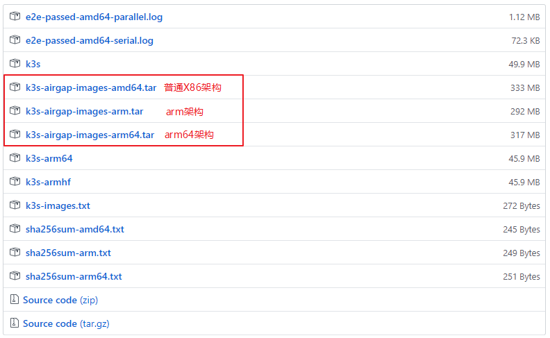

### k3s单节点server
* 没使用--datastore-endpoint时，k3s都是单server模式的
* 亲测，发现所有博客的命令都是有问题的，官方文档也是不完整的，会坑尽所有入门的开发人员，搭建集群，原本很简单的，却遇到无数坑

#### 在用centos的centos-1907的vagrant镜像创建虚拟机，然后搭建k3s集群
* 搭建k3s集群的底层容器有两种，一种是docker，一种是container
* * k3s默认用 container 容器，install.sh脚本不要做任何修改，直接运行，出错之后安装依赖再重新运行，container所有离线包加起来 11MB 左右
* * 使用 docker 容器代替 container容器，要给install.sh脚本添加参数，运行install.sh脚本的命令如下，docker所有离线包加起来 95MB 左右
```
export INSTALL_K3S_BIN_DIR=/usr/local/bin
export INSTALL_K3S_SKIP_DOWNLOAD=true
#export INSTALL_K3S_EXEC="--docker --bind-address=192.168.35.11 --no-deploy traefik"
export INSTALL_K3S_EXEC="--docker --bind-address=192.168.35.11 --no-deploy traefik --flannel-backend=none"
bash install.sh
```

### 用到的下载内容和地址
[install.sh安装脚本的下载地址 https://docs.rancher.cn/k3s/k3s-install.sh](https://docs.rancher.cn/k3s/k3s-install.sh)  
[k3s二进制文件的下载地址 https://github.com/rancher/k3s/releases](https://github.com/rancher/k3s/releases)  
[k3s依赖镜像的下载地址 https://github.com/rancher/k3s/releases](https://github.com/rancher/k3s/releases)  



##### 必须关闭防火墙和selinux，之前不关闭防火墙和selinux，出了各种各样的问题，完全解决不了，关了防火墙和selinux，问题不再出现了
```
systemctl stop firewalld
systemctl disable firewalld

sed -i 's/SELINUX=enforcing/SELINUX=disabled/g' /etc/sysconfig/selinux
sed -i 's/SELINUX=permissive/SELINUX=disabled/g' /etc/sysconfig/selinux

reboot

```

##### 以docker作为底层容器搭建k3s
```
curl -o /etc/yum.repos.d/CentOS-Base.repo http://mirrors.aliyun.com/repo/Centos-7.repo
sed -i "/mirrors.cloud.aliyuncs.com/d"  /etc/yum.repos.d/CentOS-Base.repo
echo "export LC_ALL=en_US.UTF-8" >> /etc/profile
source /etc/profile
yum clean all
yum makecache

yum install -y container-selinux selinux-policy-base
rpm -i https://rpm.rancher.io/k3s-selinux-0.1.1-rc1.el7.noarch.rpm

yum remove docker docker-client docker-client-latest docker-common docker-latest docker-latest-logrotate docker-logrotate docker-engine docker-ce
yum install -y docker
```

#### 添加docker配置文件，命令不能和上面的命令copy一起运行，好像yum导致后面的命令不运行，用rpm可以让后面的命令运行
```
mkdir -p /etc/docker
tee /etc/docker/daemon.json <<-'EOF'
{
  "registry-mirrors": ["https://kfp63jaj.mirror.aliyuncs.com"]
}
EOF
systemctl enable docker #设置docker服务开机自启动
sudo systemctl restart docker
```

#### 下载好k3s的二进制文件，下载好k3s的docker镜像

## 导入镜像，拷贝k3s文件，执行install.sh脚本
```
docker load < k3s-airgap-images-amd64.tar

# 下载好k3s的二进制文件，下载好k3s的docker镜像
curl -L https://docs.rancher.cn/k3s/k3s-install.sh > install.sh

chmod a+x install.sh k3s
\cp ./k3s /usr/local/bin

# --docker --no-deploy traefik 参数会自动拼接到 k3s.service 的 ExecStart 的命令参数
export INSTALL_K3S_BIN_DIR=/usr/local/bin
export INSTALL_K3S_SKIP_DOWNLOAD=true
export INSTALL_K3S_EXEC="--docker --no-deploy traefik "
bash install.sh

# 查看集群的节点信息
kubectl get node
# K3S_TOKEN是server端的，位于/var/lib/rancher/k3s/server/node-token下
cat /var/lib/rancher/k3s/server/node-token
```

