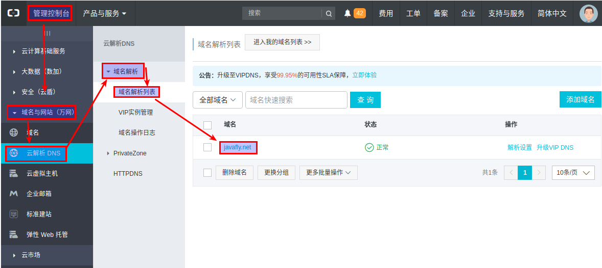
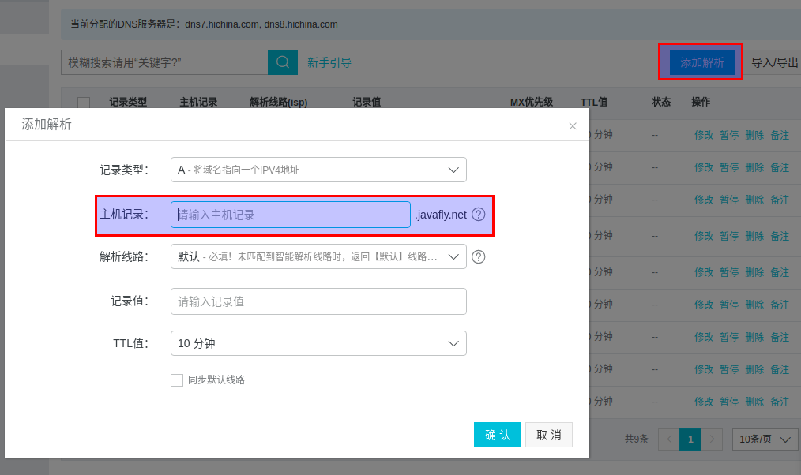

# nginx命令

### 为什么docker运行nginx需要 "deamon off"
### 为什么docker-compose运行nginx需要 "deamon off"

##### 阿里云web页面设置二级域名的步骤
[阿里云后台页面https://home.console.aliyun.com](https://home.console.aliyun.com)  
步骤01

步骤02

### 在阿里云域名生成,必须关闭防火墙
```
systemctl stop firewalld.service
systemctl disable firewalld.service
```

```
# certbot certonly --standalone --email admin@email.com -d aaa.example.com
# certbot certonly --standalone --email admin@email.com -d aaa.example.com -d bbb.example.com -d ccc.example.com -d ddd.example.com
# certbot certonly --webroot -w /usr/share/nginx/html/ --email admin@email.com -d aaa.example.com

docker run -it --rm -p 443:443 -p 80:80 -v ${PWD}/letsencrypt:/etc/letsencrypt certbot/certbot certonly --standalone --email admin@email.com -d aaa.example.com
docker run -it --rm -p 443:443 -p 80:80 -v ${PWD}/letsencrypt:/etc/letsencrypt certbot/certbot certonly --standalone --email admin@email.com -d bbb.example.com
docker run -it --rm -p 443:443 -p 80:80 -v ${PWD}/letsencrypt:/etc/letsencrypt certbot/certbot certonly --standalone --email admin@email.com -d ccc.example.com
docker run -it --rm -p 443:443 -p 80:80 -v ${PWD}/letsencrypt:/etc/letsencrypt certbot/certbot certonly --standalone --email admin@email.com -d aaa.example.com -d bbb.example.com -d ccc.example.com
```
ssl证书(https证书)
```
# docker加了 sh -c 参数后,可以执行多条命令
# docker stop aaa-domain
# docker stop bbb-domain
# docker stop ccc-domain
# docker rm aaa-domain
# docker rm bbb-domain
# docker rm ccc-domain
# docker run -itd --name aaa-domain -p 8081:80 httpd:2.2.32-alpine sh -c "echo '<h1>aaaaaaaaaa.domain</h1>' > /usr/local/apache2/htdocs/index.html && httpd-foreground"
# docker run -itd --name bbb-domain -p 8082:80 httpd:2.2.32-alpine sh -c "echo '<h1>bbbbbbbbbb.domain</h1>' > /usr/local/apache2/htdocs/index.html && httpd-foreground"
# docker run -itd --name ccc-domain -p 8083:80 httpd:2.2.32-alpine sh -c "echo '<h1>cccccccccc.domain</h1>' > /usr/local/apache2/htdocs/index.html && httpd-foreground"


docker stop aaa-domain
docker stop bbb-domain
docker stop ccc-domain
docker rm aaa-domain
docker rm bbb-domain
docker rm ccc-domain
docker run -itd --name aaa-domain -p 8081:80 nginx:1.13.12-alpine sh -c 'echo "<h1>aaaaaaaaaa.domain</h1>" > /usr/share/nginx/html/index.html && nginx -g "daemon off;"'
docker run -itd --name bbb-domain -p 8082:80 nginx:1.13.12-alpine sh -c 'echo "<h1>bbbbbbbbbb.domain</h1>" > /usr/share/nginx/html/index.html && nginx -g "daemon off;"'
docker run -itd --name ccc-domain -p 8083:80 nginx:1.13.12-alpine sh -c 'echo "<h1>cccccccccc.domain</h1>" > /usr/share/nginx/html/index.html && nginx -g "daemon off;"'

docker run -itd --name mutil-domain -p 80:80 -p 443:443 nginx:1.13.12-alpine sh -c 'echo "<h1>cccccccccc.domain</h1>" > /usr/share/nginx/html/index.html && nginx -g "daemon off;"'

```