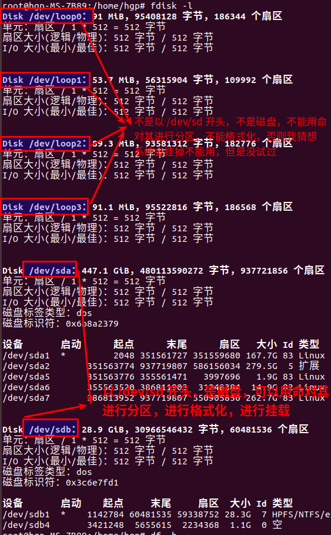
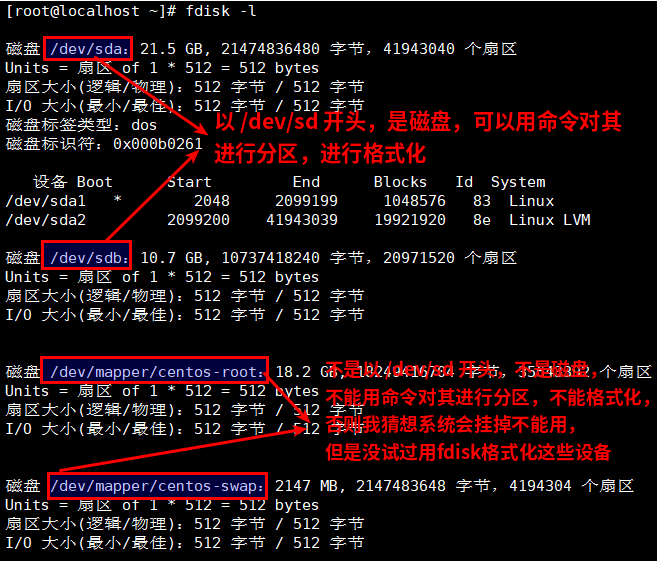
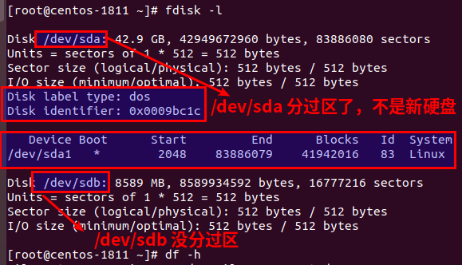

## Linux的磁盘挂载

#### 前提条件，如果不会给virtualbox虚拟机模拟几十块硬盘的话，直接忽略掉就算了，因为世界不会有物理机给你测试挂载
#### 必须实践十几次
#### 贼详细的一篇博客  centos7硬盘挂载  https://www.fujieace.com/linux/centos-mount.html
```shell
1. 查看当前硬盘使用状况：
    # df -h

2. 查看新硬盘 
    #fdisk -l
    
3. 硬盘分区 
    1. 进入fdisk模式 
        #/sbin/fdisk /dev/sdb 
    2. 输入n进行分区 
    3. 选择分区类型 
    这里有两个选项： 
        p: 主分区 linux上主分区最多能有4个 
        e: 扩展分区 linux上扩展分区只能有1个，扩展分区创建后不能直接使用，还要在扩展分区上创建逻辑分区。 
    这里我选择的p。
    4. 选择分区个数
    可以选择4个分区，这里我只分成1个分区
    5. 设置柱面，这里选择默认值就可以 
    6. 输入w，写入分区表，进行分区

4. 格式化分区 
    将新分区格式化为ext3文件系统 
    1)如果创建的是主分区 
    #mkfs -t ext3  /dev/sdb1 
    
5. 挂载硬盘 
    1) 创建挂载点 
    在根目录下创建storage目录 
    #mkdir /storage 
    2) 将/dev/sdb1挂载到/storage下 
    #mount /dev/sdb1  /storage 
    
6. 设置开机启动自动挂载 
    新创建的分区不能开机自动挂载，每次重启机器都要手动挂载。 
    设置开机自动挂载需要修改/etc/fstab文件 
    #vi /etc/fstab 
    在文件的最后增加一行，是什么格式写什么格式 
    /dev/sdb1 /storage ext3 defaults 1 2 
```

#### 操作步骤  先根据容量分出一个或者几个分区，然后格式化
* 网上没有一篇博客有说，fdisk -l 命令执行后，通过哪些标志位，哪些显示地方可以看出哪些磁盘是挂载的，哪些磁盘是没有挂载的，如何查看磁盘的个数，网上没有一篇博客有说，全部是废话，直接说 /dev/sdb 是没有挂载的，/dev/sdb 要格式化分区的，没给出任何说明，任何理由，线上操作，谁敢啥几把地操作，全都是坑

### 个人总结出来的，但是没有人指导，没有博客和文档有说到我下面总结的结论是否正确的，但是毫无保留地相信自己的总结，即使在线上操作，毁掉一切都在所不惜
* fdisk -l 命令执行后，/dev/sd 开头的都是磁盘，其他的都不是  
  
 
* 有下面圈的都是分过区的硬盘，没有圈的都是新挂载的硬盘  
 

```
lsblk # 查看以挂载的分区
df -hT  # 查看硬盘ext2、ext3、ext4、xfs类型
```

### 给根目录扩容
```
yum install lvm2
pvcreate /dev/sdb1
```