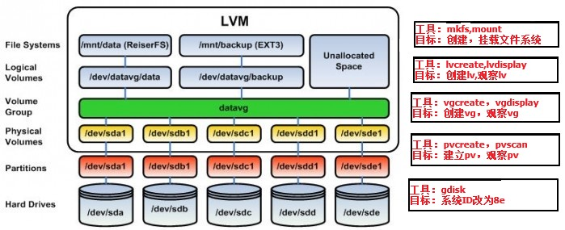

### linux磁盘扩容

> 努力不一定成功，但不努力一定很轻松  
> 失败过的两次例子，以后遇到过同样环境的电脑还是会扩容失败，无从下手  
> > 1) vagrant创建的虚拟机，lvdisplay，vgdisplay，pvdisplay 命令执行后，没有任何输出，无从下手 ，不知道怎么扩容 
> > 2) 自己组装的电脑安装Ubuntu-18.04，lvdisplay，vgdisplay，pvdisplay 命令执行后，没有任何输出，无从下手 ，不知道怎么扩容 

#### 原理
 
* 物理存储介质(PhysicalStorageMedia)：指系统的物理存储设备：磁盘，如：/dev/hda、/dev/sda等，是存储系统最底层的存储单元。
* 物理卷(Physical Volume，PV)：可以在上面建立卷组的媒介，可以是硬盘分区，也可以是硬盘本身或者回环文件(loopback file)，它是LVM的基本存储逻辑块。物理卷包括一个特殊的header，其余部分被切割为一块块物理区域(physical extents)。
* * 物理块(Physical Extent，PE)：每一个物理卷PV被划分为称为PE(Physical Extents)的基本单元，具有唯一编号的PE是可以被LVM寻址的最小单元。PE的大小是可配置的，默认为4MB。所以物理卷(PV)由大小等同的基本单元PE组成。
* 卷组(Volume Group，VG)：将一组物理卷收集为一个管理单元，类似于非LVM系统中的物理磁盘，其由一个或多个物理卷PV组成。可以在卷组上创建一个或多个LV(逻辑卷)。
* 逻辑卷(Logical Volume，LV)：虚拟分区，由物理区域(physical extents)组成，逻辑卷建立在卷组VG之上。在逻辑卷LV之上可以建立文件系统(比如/home或者/usr等)。
* * 逻辑块(Logical Extent，LE)：逻辑卷LV也被划分为可被寻址的基本单位，称为LE。在同一个卷组中，LE的大小和PE是相同的，并且一一对应。

##### 可能需要安装的软件 
```
yum install lvm2                         # 对应命令 lvdisplay，vgdisplay，pvdisplay
yum install e2fsprogs               # 对应命令 resize2fs
yum install xfsprogs.x86_64  # 对应命令 xfs_growfs
```

> pvdisplay  
* 基于硬盘分区 `/dev/sda2` 的物理卷，所属卷组为 centos，总容量小于27G，总物理区域（PE）为6911个
```
[root@storage ~]# pvdisplay
  --- Physical volume ---
  PV Name               /dev/sda2
  VG Name               centos
  PV Size               <27.00 GiB / not usable 3.00 MiB
  Allocatable           yes 
  PE Size               4.00 MiB
  Total PE              6911
  Free PE               1
  Allocated PE          6910
  PV UUID               vOsTdC-wSt0-mxsR-s2z4-Kryu-BQ0m-DAFb1y
   
[root@storage ~]# 
```

> vgdisplay
* centos卷组
```
[root@storage ~]# vgdisplay
  --- Volume group ---
  VG Name               centos
  System ID             
  Format                lvm2
  Metadata Areas        1
  Metadata Sequence No  3
  VG Access             read/write
  VG Status             resizable
  MAX LV                0
  Cur LV                2
  Open LV               2
  Max PV                0
  Cur PV                1
  Act PV                1
  VG Size               <27.00 GiB
  PE Size               4.00 MiB
  Total PE              6911
  Alloc PE / Size       6910 / 26.99 GiB
  Free  PE / Size       1 / 4.00 MiB
  VG UUID               lzK4ZT-b8BC-POvu-s8oE-TIco-ceiK-CjHAhz
   
[root@storage ~]# 
```

> lvdisplay
* 这里目前有两个逻辑卷，一个是文件系统所在的volume，另一个是swap分区使用的volume，我们对root进行扩容
```
[root@storage ~]# lvdisplay
  --- Logical volume ---
  LV Path                /dev/centos/swap
  LV Name                swap
  VG Name                centos
  LV UUID                Z4XOx0-7g7u-U92d-402X-m1W8-eDEe-8Xiqzl
  LV Write Access        read/write
  LV Creation host, time localhost, 2020-01-12 00:52:42 +0800
  LV Status              available
  # open                 2
  LV Size                2.00 GiB
  Current LE             512
  Segments               1
  Allocation             inherit
  Read ahead sectors     auto
  - currently set to     8192
  Block device           253:1
   
  --- Logical volume ---
  LV Path                /dev/centos/root      # 对这个进行扩容
  LV Name                root
  VG Name                centos
  LV UUID                1wIxix-HiFK-J5eX-Pcio-Az14-K9eV-7UP7rC
  LV Write Access        read/write
  LV Creation host, time localhost, 2020-01-12 00:52:42 +0800
  LV Status              available
  # open                 1
  LV Size                24.99 GiB
  Current LE             6398
  Segments               1
  Allocation             inherit
  Read ahead sectors     auto
  - currently set to     8192
  Block device           253:0
   
[root@storage ~]#
```


#### 进行扩容实践
> fdisk -l
* 查看系统中未格式化，未分区的磁盘，磁盘 `/dev/sdb` 没有 磁盘标签类型 和 磁盘标识符，该磁盘是没有分区和格式化的
```
[root@storage ~]# fdisk -l

Disk /dev/sdb: 10.7 GB, 10737418240 bytes, 20971520 sectors
Units = sectors of 1 * 512 = 512 bytes
Sector size (logical/physical): 512 bytes / 512 bytes
I/O size (minimum/optimal): 512 bytes / 512 bytes
Disk label type: dos
Disk identifier: 0x2d5c955e

   Device Boot      Start         End      Blocks   Id  System
/dev/sdb1            2048    20971519    10484736   83  Linux

Disk /dev/sda: 30.1 GB, 30064771072 bytes, 58720256 sectors
Units = sectors of 1 * 512 = 512 bytes
Sector size (logical/physical): 512 bytes / 512 bytes
I/O size (minimum/optimal): 512 bytes / 512 bytes
Disk label type: dos
Disk identifier: 0x000bc7b7

   Device Boot      Start         End      Blocks   Id  System
/dev/sda1   *        2048     2099199     1048576   83  Linux
/dev/sda2         2099200    58720255    28310528   8e  Linux LVM

Disk /dev/mapper/centos-root: 26.8 GB, 26835156992 bytes, 52412416 sectors
Units = sectors of 1 * 512 = 512 bytes
Sector size (logical/physical): 512 bytes / 512 bytes
I/O size (minimum/optimal): 512 bytes / 512 bytes


Disk /dev/mapper/centos-swap: 2147 MB, 2147483648 bytes, 4194304 sectors
Units = sectors of 1 * 512 = 512 bytes
Sector size (logical/physical): 512 bytes / 512 bytes
I/O size (minimum/optimal): 512 bytes / 512 bytes

[root@storage ~]#
```

> fdisk /dev/sdb
* 对 `/dev/sdb` 磁盘进行分区，分一个区，所有空间都分配给该分区
```
[root@storage ~]# fdisk /dev/sdb
Welcome to fdisk (util-linux 2.23.2).

Changes will remain in memory only, until you decide to write them.
Be careful before using the write command.


Command (m for help): n
Partition type:
   p   primary (0 primary, 0 extended, 4 free)
   e   extended
Select (default p): 
Using default response p
Partition number (1-4, default 1): 
First sector (2048-20971519, default 2048): 
Using default value 2048
Last sector, +sectors or +size{K,M,G} (2048-20971519, default 20971519): 
Using default value 20971519
Partition 1 of type Linux and of size 10 GiB is set

Command (m for help): w
The partition table has been altered!

Calling ioctl() to re-read partition table.
Syncing disks.
[root@storage ~]#
```

###### 如果分区大小设置错误，用 d 参数删除之前的配置
> fdisk /dev/sdb
* 如果分区大小设置错误，用 d 参数删除之前的配置
```
[root@storage ~]# fdisk /dev/sdb
Welcome to fdisk (util-linux 2.23.2).

Changes will remain in memory only, until you decide to write them.
Be careful before using the write command.


Command (m for help): m
Command action
   a   toggle a bootable flag
   b   edit bsd disklabel
   c   toggle the dos compatibility flag
   d   delete a partition
   g   create a new empty GPT partition table
   G   create an IRIX (SGI) partition table
   l   list known partition types
   m   print this menu
   n   add a new partition
   o   create a new empty DOS partition table
   p   print the partition table
   q   quit without saving changes
   s   create a new empty Sun disklabel
   t   change a partition's system id
   u   change display/entry units
   v   verify the partition table
   w   write table to disk and exit
   x   extra functionality (experts only)

Command (m for help): d
Selected partition 1
Partition 1 is deleted

Command (m for help): d
No partition is defined yet!

Command (m for help): w
The partition table has been altered!

Calling ioctl() to re-read partition table.
Syncing disks.
[root@storage ~]# 
```

> fdisk -l
* 查看刚刚分区的磁盘
```
[root@storage ~]# fdisk -l

Disk /dev/sdb: 10.7 GB, 10737418240 bytes, 20971520 sectors
Units = sectors of 1 * 512 = 512 bytes
Sector size (logical/physical): 512 bytes / 512 bytes
I/O size (minimum/optimal): 512 bytes / 512 bytes
Disk label type: dos
Disk identifier: 0x2d5c955e

   Device Boot      Start         End      Blocks   Id  System
/dev/sdb1            2048    20971519    10484736   83  Linux

Disk /dev/sda: 30.1 GB, 30064771072 bytes, 58720256 sectors
Units = sectors of 1 * 512 = 512 bytes
Sector size (logical/physical): 512 bytes / 512 bytes
I/O size (minimum/optimal): 512 bytes / 512 bytes
Disk label type: dos
Disk identifier: 0x000bc7b7

   Device Boot      Start         End      Blocks   Id  System
/dev/sda1   *        2048     2099199     1048576   83  Linux
/dev/sda2         2099200    58720255    28310528   8e  Linux LVM

Disk /dev/mapper/centos-root: 26.8 GB, 26835156992 bytes, 52412416 sectors
Units = sectors of 1 * 512 = 512 bytes
Sector size (logical/physical): 512 bytes / 512 bytes
I/O size (minimum/optimal): 512 bytes / 512 bytes


Disk /dev/mapper/centos-swap: 2147 MB, 2147483648 bytes, 4194304 sectors
Units = sectors of 1 * 512 = 512 bytes
Sector size (logical/physical): 512 bytes / 512 bytes
I/O size (minimum/optimal): 512 bytes / 512 bytes

[root@storage ~]# 
```

> df -Th
* 查看分区的文件系统格式，把新的磁盘格式化成要扩容分区的格式
```
[root@storage ~]# df -Th
Filesystem              Type      Size  Used Avail Use% Mounted on
devtmpfs                devtmpfs  484M     0  484M   0% /dev
tmpfs                   tmpfs     496M     0  496M   0% /dev/shm
tmpfs                   tmpfs     496M  6.8M  489M   2% /run
tmpfs                   tmpfs     496M     0  496M   0% /sys/fs/cgroup
/dev/mapper/centos-root xfs        25G  1.2G   24G   5% /
/dev/sda1               xfs      1014M  136M  879M  14% /boot
tmpfs                   tmpfs     100M     0  100M   0% /run/user/0
[root@storage ~]# 
```

> mkfs.xfs /dev/sdb1
* mkfs  -t  ext3  /dev/sdb1
* mkfs.ext4 /dev/sdb1 
* 格式化分区与对应要扩容分区的文件系统格式
```
[root@storage ~]# mkfs.xfs /dev/sdb1
meta-data=/dev/sdb1              isize=512    agcount=4, agsize=655296 blks
         =                       sectsz=512   attr=2, projid32bit=1
         =                       crc=1        finobt=0, sparse=0
data     =                       bsize=4096   blocks=2621184, imaxpct=25
         =                       sunit=0      swidth=0 blks
naming   =version 2              bsize=4096   ascii-ci=0 ftype=1
log      =internal log           bsize=4096   blocks=2560, version=2
         =                       sectsz=512   sunit=0 blks, lazy-count=1
realtime =none                   extsz=4096   blocks=0, rtextents=0
[root@storage ~]# 
```

> pvcreate /dev/sdb1
* 对 `/dev/sdb1` 创建物理卷，如果输入命令后提示 文件系统格式 signature detected on /dev/sdb1 at offset 0，输入y
```
[root@storage ~]# pvcreate /dev/sdb1
WARNING: xfs signature detected on /dev/sdb1 at offset 0. Wipe it? [y/n]: y
  Wiping xfs signature on /dev/sdb1.
  Physical volume "/dev/sdb1" successfully created.
[root@storage ~]# 
```

> pvdisplay
* 查看物理卷，此时多出了 `/dev/sdb1` 物理卷
```
[root@storage ~]# pvdisplay
  --- Physical volume ---
  PV Name               /dev/sda2
  VG Name               centos
  PV Size               <27.00 GiB / not usable 3.00 MiB
  Allocatable           yes 
  PE Size               4.00 MiB
  Total PE              6911
  Free PE               1
  Allocated PE          6910
  PV UUID               vOsTdC-wSt0-mxsR-s2z4-Kryu-BQ0m-DAFb1y
   
  "/dev/sdb1" is a new physical volume of "<10.00 GiB"
  --- NEW Physical volume ---
  PV Name               /dev/sdb1
  VG Name               
  PV Size               <10.00 GiB
  Allocatable           NO
  PE Size               0   
  Total PE              0
  Free PE               0
  Allocated PE          0
  PV UUID               xSWaay-vcsZ-AH2U-T5Qx-asVh-rDHN-efkIbL
   
[root@storage ~]#
```

> vgextend centos /dev/sdb1
* vgextend 用于动态地扩展卷组，通过向卷组中添加物理卷来增加卷组的容量。 将 `/dev/sdb1` 添加到 `centos` 卷组
```
[root@storage ~]# vgextend centos /dev/sdb1
  Volume group "centos" successfully extended
[root@storage ~]#
```

> vgdisplay
* 查看卷组的情况，发现 centos 卷组增加了 10G 的空闲空间
```
[root@storage ~]# vgdisplay
  --- Volume group ---
  VG Name               centos
  System ID             
  Format                lvm2
  Metadata Areas        2
  Metadata Sequence No  4
  VG Access             read/write
  VG Status             resizable
  MAX LV                0
  Cur LV                2
  Open LV               2
  Max PV                0
  Cur PV                2
  Act PV                2
  VG Size               36.99 GiB
  PE Size               4.00 MiB
  Total PE              9470
  Alloc PE / Size       6910 / 26.99 GiB
  Free  PE / Size       2560 / 10.00 GiB   # 增加了 10G 的空闲空间
  VG UUID               lzK4ZT-b8BC-POvu-s8oE-TIco-ceiK-CjHAhz
   
[root@storage ~]# 
```

> lvdisplay
* 查看扩容前的 `/dev/centos/root` 卷组的大小 ， lvdisplay /dev/centos/root
```
[root@storage ~]# lvdisplay
  --- Logical volume ---
  LV Path                /dev/centos/swap
  LV Name                swap
  VG Name                centos
  LV UUID                Z4XOx0-7g7u-U92d-402X-m1W8-eDEe-8Xiqzl
  LV Write Access        read/write
  LV Creation host, time localhost, 2020-01-12 00:52:42 +0800
  LV Status              available
  # open                 2
  LV Size                2.00 GiB
  Current LE             512
  Segments               1
  Allocation             inherit
  Read ahead sectors     auto
  - currently set to     8192
  Block device           253:1
   
  --- Logical volume ---
  LV Path                /dev/centos/root
  LV Name                root
  VG Name                centos
  LV UUID                1wIxix-HiFK-J5eX-Pcio-Az14-K9eV-7UP7rC
  LV Write Access        read/write
  LV Creation host, time localhost, 2020-01-12 00:52:42 +0800
  LV Status              available
  # open                 1
  LV Size                24.99 GiB
  Current LE             6398
  Segments               1
  Allocation             inherit
  Read ahead sectors     auto
  - currently set to     8192
  Block device           253:0
   
[root@storage ~]# 
```

> lvextend -l +100%FREE  /dev/centos/root
* 把10G空间百分百扩容到 /dev/centos/root
```
[root@storage ~]# lvextend -l +100%FREE  /dev/centos/root
  Size of logical volume centos/root changed from 24.99 GiB (6398 extents) to 34.99 GiB (8958 extents).
  Logical volume centos/root successfully resized.
[root@storage ~]#
```

> lvdisplay /dev/centos/root
* 查看扩容后的 `/dev/centos/root` 卷组的大小
```
[root@storage ~]# lvdisplay /dev/centos/root
  --- Logical volume ---
  LV Path                /dev/centos/root
  LV Name                root
  VG Name                centos
  LV UUID                1wIxix-HiFK-J5eX-Pcio-Az14-K9eV-7UP7rC
  LV Write Access        read/write
  LV Creation host, time localhost, 2020-01-12 00:52:42 +0800
  LV Status              available
  # open                 1
  LV Size                34.99 GiB
  Current LE             8958
  Segments               2
  Allocation             inherit
  Read ahead sectors     auto
  - currently set to     8192
  Block device           253:0
   
[root@storage ~]# 
```

> xfs_growfs /dev/centos/root
* 告知系统 "/" 分区扩容了，如果遇到错误 xfs_growfs: /dev/centos/root is not a mounted XFS filesystem , 用命令 resize2fs /dev/centos/root 告知系统 "/" 分区扩容了
```
# 第一种情况，遇到  xfs_growfs: /dev/centos/root is not a mounted XFS filesystem 问题后，改成 resize2fs 命令
[root@storage ~]# xfs_growfs /dev/centos/root
xfs_growfs: /dev/centos/root is not a mounted XFS filesystem
[root@storage ~]# resize2fs /dev/centos/root
resize2fs 1.42.9 (28-Dec-2013)
Filesystem at /dev/centos/root is mounted on /u01; on-line resizing required
old desc_blocks = 3, new_desc_blocks = 15
Performing an on-line resize of /dev/centos/root to 3930112 (4k) blocks.
The filesystem on /dev/centos/root is now 3930112 blocks long.

 # 第二种情况是，使用 xfs_growfs /dev/centos/root 命令不提示任何有问题的
 [root@storage ~]# xfs_growfs /dev/centos/root
 meta-data=/dev/mapper/centos-root isize=512    agcount=4, agsize=1637888 blks
                       =                       sectsz=512   attr=2, projid32bit=1
                       =                       crc=1        finobt=0 spinodes=0
data              =                       bsize=4096   blocks=6551552, imaxpct=25
                       =                       sunit=0      swidth=0 blks
naming       =version 2              bsize=4096   ascii-ci=0 ftype=1
log                =internal               bsize=4096   blocks=3199, version=2
                      =                       sectsz=512   sunit=0 blks, lazy-count=1
realtime =none                   extsz=4096   blocks=0, rtextents=0
data blocks changed from 6551552 to 9172992
[root@storage ~]# 
```

> df -Th
* 查看分区后的根目录是否扩容成功，然后重启系统
```
[root@storage ~]# df -Th
Filesystem              Type      Size  Used Avail Use% Mounted on
devtmpfs                devtmpfs  484M     0  484M   0% /dev
tmpfs                   tmpfs     496M     0  496M   0% /dev/shm
tmpfs                   tmpfs     496M  6.8M  489M   2% /run
tmpfs                   tmpfs     496M     0  496M   0% /sys/fs/cgroup
/dev/mapper/centos-root xfs        35G  1.2G   34G   4% /
/dev/sda1               xfs      1014M  136M  879M  14% /boot
tmpfs                   tmpfs     100M     0  100M   0% /run/user/0
[root@storage ~]#
```