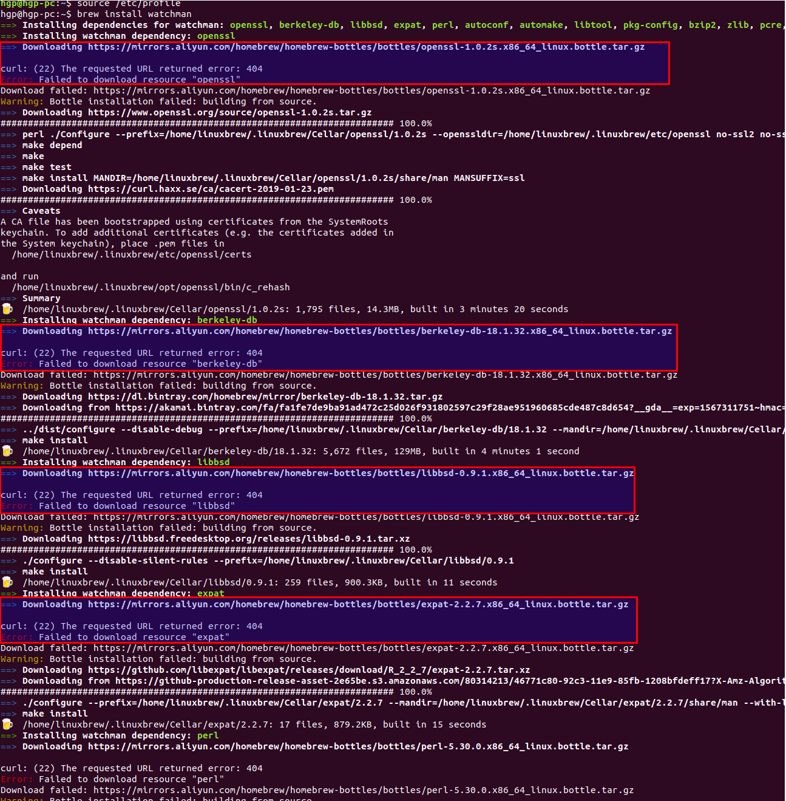

## Ubuntu安装brew, brew是软件包管理工具,

* 20190901-1211测试发现, 用brew install watchman 安装watchman时, 发现阿里的brew仓库残缺得厉害, 安装watchman需要的很多依赖都没有


```
sudo apt-get install -y linuxbrew-wrapper
sudo apt-get install -y build-essential
```

#### 使用 Alibaba 的 Homebrew 镜像源进行加速
* 平时我们执行 brew 命令安装软件的时候，跟以下 3 个仓库地址有关：
> brew.git
> homebrew-core.git
> homebrew-bottles

#### 通过以下操作将这 3 个仓库地址全部替换为 Alibaba 提供的地址
```
# 替换 brew.git 仓库地址 为阿里巴巴的 brew.git 仓库地址: 
cd "$(brew --repo)" 
git remote set-url origin https://mirrors.aliyun.com/homebrew/brew.git 
# 还原 brew.git 仓库地址 为官方提供的 brew.git 仓库地址 
# cd "$(brew --repo)" 
# git remote set-url origin https://github.com/Homebrew/brew.git
 
# 替换 homebrew-core.git 仓库地址 为阿里巴巴的 homebrew-core.git 仓库地址: 
cd "$(brew --repo)/Library/Taps/homebrew/homebrew-core" 
git remote set-url origin https://mirrors.aliyun.com/homebrew/homebrew-core.git 
# 还原 homebrew-core.git 仓库地址 为官方提供的 homebrew-core.git 仓库地址 
# cd "$(brew --repo)/Library/Taps/homebrew/homebrew-core" 
# git remote set-url origin https://github.com/Homebrew/homebrew-core.git
 
# 替换成阿里的 homebrew-bottles 访问地址
sudo echo 'export HOMEBREW_BOTTLE_DOMAIN=https://mirrors.aliyun.com/homebrew/homebrew-bottles' >> /etc/profile
source /etc/profile

# 还原为官方提供的 homebrew-bottles 
# 删除 HOMEBREW_BOTTLE_DOMAIN 这一行配置
source /etc/profile
```

#### 安装watchman的例子, 整个过程耗时一个多小时, 那种绝望与无奈
```
brew install watchman
# 会下载很多依赖的源码包, 编译安装, 整个编译过程耗费一个多小时, 居然没有现成的二进制安装包, 浪费生命和时间, brew这种仓库有毛意义
```