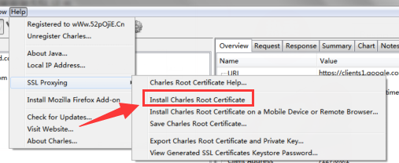
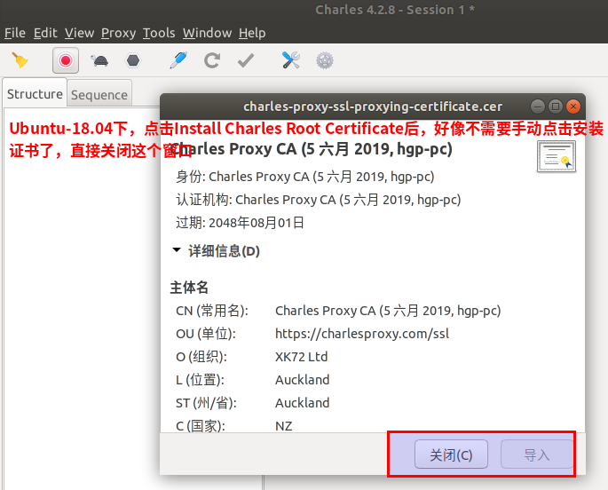
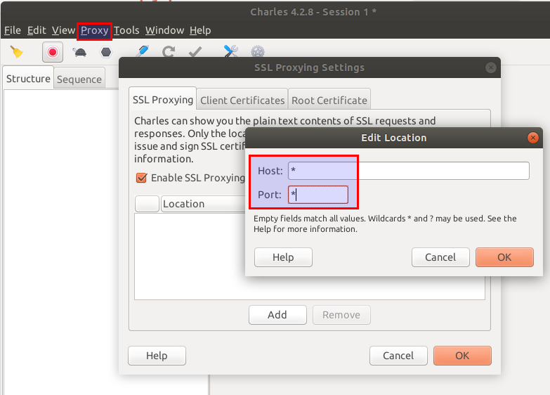
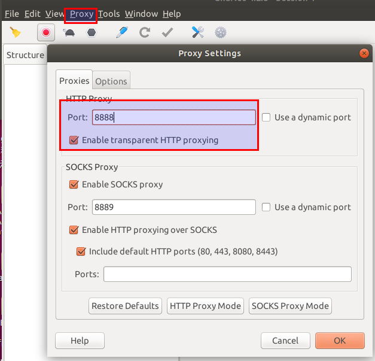
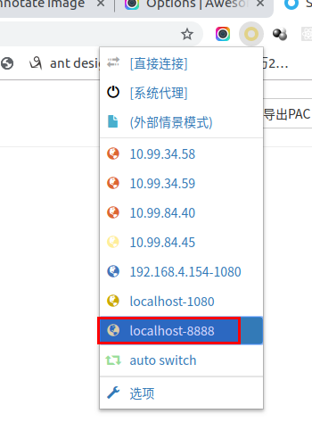
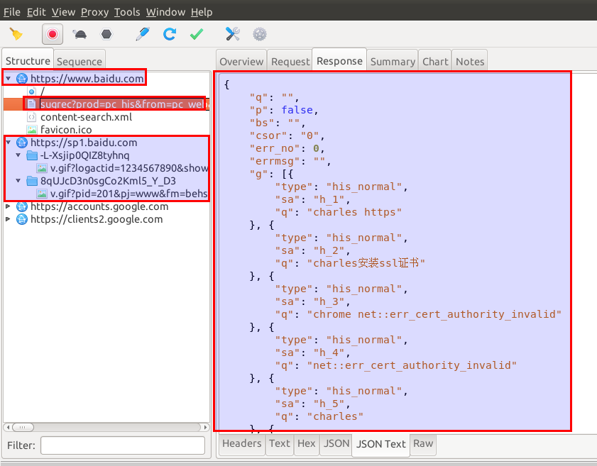
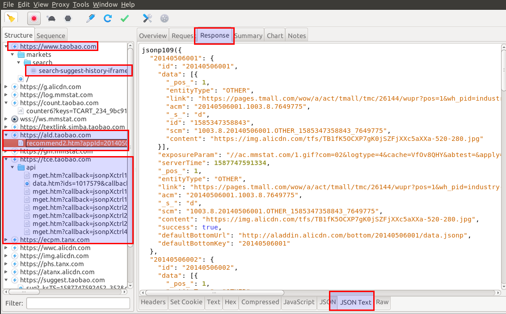

## charles的https抓包

* 我在Ubuntu-18.04配置charles抓取https包时很痛苦，没人教，网上的那些Ubuntu配置charles的博客省略了一些步骤，同时没对一些现象进行说明，导致自己在配置时很痛苦

#### install charles root certificate
* Help  ->  SSL Proxying  ->  Install Charles Root Certificate
* 无尽的痛苦，在Ubuntu-18.04下，无法用截图工具截取Charles配置 Install Charles Root Certificate 的图片，一移动鼠标到截图软件，Charles的二级菜单就会失焦隐藏，只能用Windows下的截图做讲解   



* windows系统，点击了 install charles root certificate 后，不停地点击下一步，直到最后确定，这样子完成证书安装

#### 配置要抓取的域名，用*通配符，表示抓取所有的域名
* Proxy  ->  SSL Proxying Settings  ->  Enable SSL Proxying    



#### ubuntu系统要配置Charles代理的端口，Windows可以不要配置
* Proxy  ->  Proxying Settings    


#### ubuntu系统要配置SwitchyOmega，Windows可以不要配置     


### 配置Charles抓取浏览器的https请求时，会导致浏览器抛错，最有效的解决方式是配置 --ignore-certificate-errors 参数，网上博客的其他方法都是坑爹，都是浪费生命时间的
* 看了Ubuntu下/usr/share/applications/google-chrome.desktop配置文件，得知如何给chrome配置参数，命令如下
```
/usr/bin/google-chrome-stable --ignore-certificate-errors
```

* windows操作系统
```
1.  找到你的Chrome快捷方式.
2.  右键图标,选择属性
3.  找到”目标”文本框,里面的内容是你的Chrome程序路径,类似这样C:\\Users\\Administrator\\AppData\\Local\\Google\\Chrome\\Application\\chrome.exe
4.  在这段文本的后面输入一个空格,然后输入-ignore-certificate-errors
5.  修改后的文本应该类似于这样:C:\\Users\\Administrator\\AppData\\Local\\Google\\Chrome\\Application\\chrome.exe -ignore-certificate-errors
6.  点击确定
7.  重新打开你的Chrome浏览器
```

#### Charles抓取百度和淘宝的效果图


