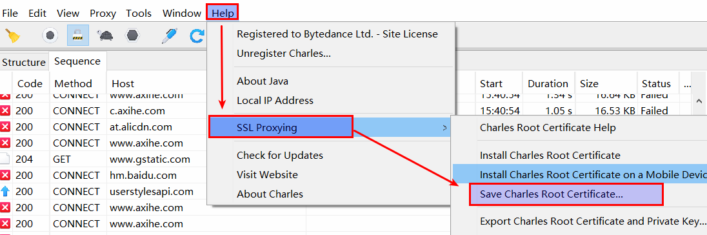
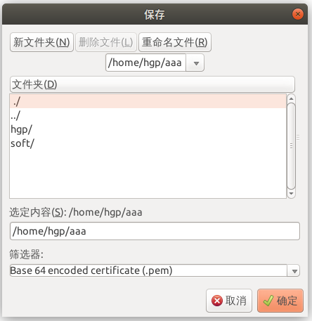
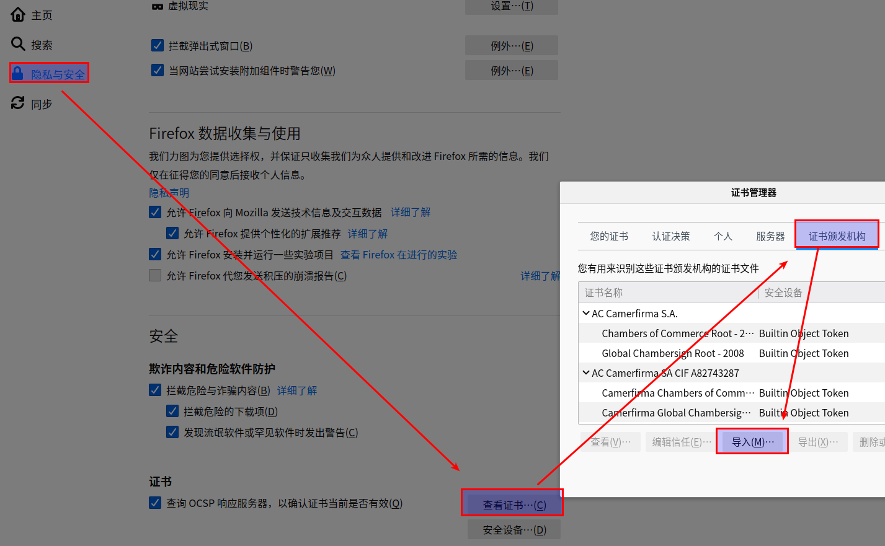
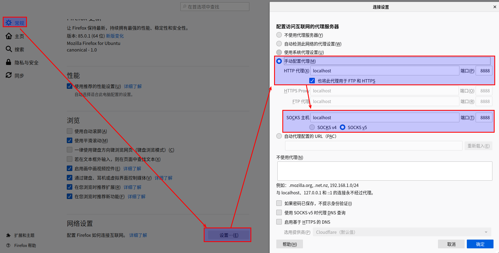
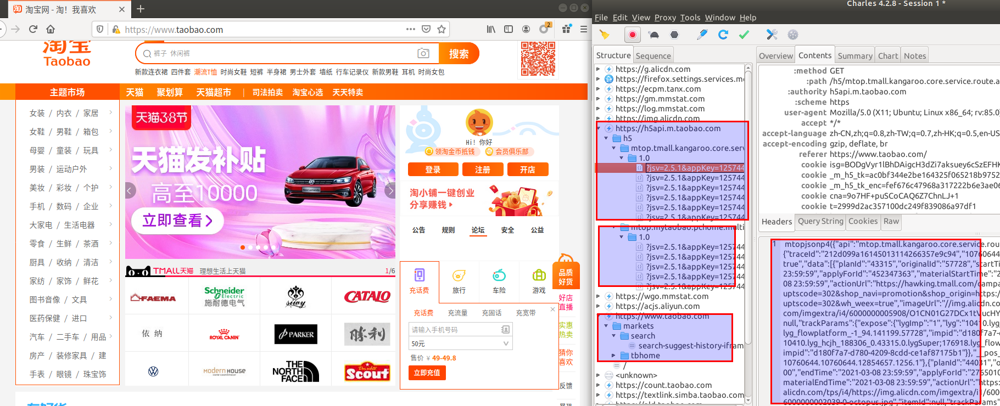

## firefox和charles抓取https请求

#### 安装根证书 install charles root certificate
* Help  ->  SSL Proxying  ->  Install Charles Root Certificate
* 在Ubuntu-18.04下，无法用Shutter截取Charles配置 Install Charles Root Certificate 的图片，一移动鼠标到Shutter截图软件，Charles的二级菜单就会失焦隐藏，截取不了Install Charles Root Certificate菜单项的图片，只能盗用Windows下的截图做讲解，第二幅图，如果证书没有安装，就不停地点击确定来安装   

#### 在charles软件导出根证书，在网上找了window的截图，用Ubuntu的Shutter截图，charles二级菜单会失焦，截取不来图片

#### 配置要抓取的域名，用*通配符，表示抓取所有的域名
* Proxy  ->  SSL Proxying Settings  ->  Enable SSL Proxying    

#### ubuntu系统要配置Charles代理的端口，Windows可以不要配置
* Proxy  ->  Proxying Settings    

#### 在firefox导入证书

#### 在firefox配置代理端口

#### 抓取Firefox浏览器的taobao数据截图
