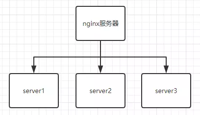
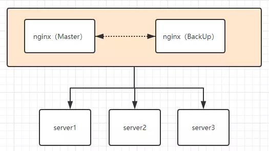

### 配置keepalived和nginx

#### 用到的知识点
* 通过vagrant脚本批量创建虚拟机，通过vagrant脚本批量创建虚拟机是一切服务器集群搭建的根本，在博主的当前仓库的笔记有关于vagrant的知识
* 学会keepalived的配置参数，默认配置文件路径是 /etc/keepalived/keepalived.conf
* 理论知识，VRRP虚拟路由冗余协议，keepalived的原理所在

#### 服务的架构图
  
  


| 名称  | IP | 虚拟IP |
| ---- | ---- | ---- |
| 虚拟机1(VM1)   | 192.168.35.2  | 192.168.35.99 |
| 虚拟机2(VM2)   | 192.168.35.3  | 192.168.35.99 |

#### 准备环境
* Centos环境
* * yum安装keepalived，nginx，安装完之后用  whereis nginx ，whereis keepalived ，查看安装路径
```
mv /etc/yum.repos.d/CentOS-Base.repo /etc/yum.repos.d/CentOS-Base.repo.backup
curl -o /etc/yum.repos.d/CentOS-Base.repo http://mirrors.aliyun.com/repo/Centos-7.repo
sed -i "/mirrors.aliyuncs.com/d"  /etc/yum.repos.d/CentOS-Base.repo
sed -i "/mirrors.cloud.aliyuncs.com/d"  /etc/yum.repos.d/CentOS-Base.repo
yum clean all && yum makecache
rpm -Uvh http://nginx.org/packages/centos/7/noarch/RPMS/nginx-release-centos-7-0.el7.ngx.noarch.rpm
yum install -y nginx keepalived
# 设置nginx开机启动
systemctl enable nginx && systemctl restart nginx

# 设置keepalived开机启动
systemctl enable keepalived && systemctl restart keepalived

# whereis nginx
# whereis keepalived
```

* Ubuntu环境
* * apt安装keepalived，nginx，安装完之后用  whereis nginx ，whereis keepalived ，查看安装路径
```
cp /etc/apt/sources.list /etc/apt/sources.list.bak
echo "deb http://mirrors.aliyun.com/ubuntu/ $(lsb_release -cs) main restricted universe multiverse" > /etc/apt/sources.list
echo "deb http://mirrors.aliyun.com/ubuntu/ $(lsb_release -cs)-security main restricted universe multiverse" >> /etc/apt/sources.list
echo "deb http://mirrors.aliyun.com/ubuntu/ $(lsb_release -cs)-updates main restricted universe multiverse" >> /etc/apt/sources.list
echo "deb http://mirrors.aliyun.com/ubuntu/ $(lsb_release -cs)-proposed main restricted universe multiverse" >> /etc/apt/sources.list
echo "deb http://mirrors.aliyun.com/ubuntu/ $(lsb_release -cs)-backports main restricted universe multiverse" >> /etc/apt/sources.list
echo "deb [arch=amd64] https://mirrors.ustc.edu.cn/docker-ce/linux/ubuntu $(lsb_release -cs) stable" >> /etc/apt/sources.list
apt-get update && apt-get clean && apt-get autoclean && apt-get autoremove

# Ubuntu配置的nginx软件下载地址，Ubuntu自带的默认地址，下载的nginx版本有点低
mkdir -p /etc/apt/sources.list.d
echo "deb https://nginx.org/packages/ubuntu/ $(lsb_release -cs) nginx" > /etc/apt/sources.list.d/nginx.list
echo "deb-src https://nginx.org/packages/ubuntu/ $(lsb_release -cs) nginx" >> /etc/apt/sources.list.d/nginx.list
apt-key adv --keyserver keyserver.ubuntu.com --recv-keys ABF5BD827BD9BF62
apt-get update && apt-get install -y nginx

# 设置nginx开机启动
systemctl enable nginx && systemctl restart nginx

# 安装keepalived
apt-get install keepalived

# 设置keepalived开机启动
systemctl enable keepalived && systemctl restart keepalived

# whereis nginx
# whereis keepalived
```

#### 改写nginx的首页，192.168.35.2 和 192.168.35.3 的nginx首页分别写上这两个IP，为了以后测试查看哪个服务器响应了请求

#### 关闭防火墙，避免出现其他问题，也可以不关闭，到时候出问题了再google解决方法
```
systemctl stop firewalld.service        #临时关闭，重启失效
systemctl disable firewalld.service  #禁止开机启动
```

#### 修改keepalived的配置文件
* keepalived的配置文件默认路径 /etc/keepalived/keepalived.conf
###### 主节点的keepalived配置文件
```
tee /etc/keepalived/keepalived.conf <<-'EOF'
! Configuration File for keepalived

global_defs {
 #  notification_email {
 #    acassen@firewall.loc
 #    failover@firewall.loc
 #    sysadmin@firewall.loc
 #  }
 #  notification_email_from Alexandre.Cassen@firewall.loc
 #  smtp_server 192.168.200.1
 #  smtp_connect_timeout 30
   router_id LVS_DEVEL
 #  vrrp_skip_check_adv_addr
 #  vrrp_strict
 #  vrrp_garp_interval 0
 #  vrrp_gna_interval 0
}
vrrp_script chk_nginx {
        script "/etc/keepalived/nginx_check.sh"
        interval 2
        weight -20
}
vrrp_instance VI_1 {
    state MASTER # 标识为主服务
    interface ens33 #绑定虚拟机的IP
    virtual_router_id 51 # 虚拟路由id，和从机保持一致
    #mcast_src_ip 192.168.35.2  #本机ip
    priority 100 #权重，需要大于主节点
    advert_int 1
    authentication {
        auth_type PASS
        auth_pass 1111
    }
   track_script {
                chk_nginx ## 执行 Nginx 监控的服务
        }
    virtual_ipaddress {
        192.168.35.99
        #192.168.35.100
        #192.168.35.101
    }
}
EOF
```

###### 从节点的keepalived配置文件
```
tee /etc/keepalived/keepalived.conf <<-'EOF'
! Configuration File for keepalived

global_defs {
#   notification_email {
#     acassen@firewall.loc
#     failover@firewall.loc
#     sysadmin@firewall.loc
#   }
#   notification_email_from Alexandre.Cassen@firewall.loc
#   smtp_server 192.168.200.1
#   smtp_connect_timeout 30
   router_id dreamer1
#   vrrp_skip_check_adv_addr
#   vrrp_strict
#   vrrp_garp_interval 0
#   vrrp_gna_interval 0
}
vrrp_script chk_nginx {
        script "/etc/keepalived/nginx_check.sh" ## 检测 nginx 状态的脚本路径
        interval 2 ## 检测时间间隔
        weight -20 ## 如果条件成立，权重-20
}

vrrp_instance VI_1 {
    state BACKUP
    interface ens33
    virtual_router_id 51  # 虚拟路由id，和主节点保持一致
    #mcast_src_ip 192.168.35.3 ## 本机 IP 地址 
    priority 90 #权重，需要小于主节点
    advert_int 1
    authentication {
        auth_type PASS
        auth_pass 1111
    }
    track_script {
            chk_nginx ## 执行 Nginx 监控的服务
    }
    virtual_ipaddress {
        192.168.35.99
        #192.168.35.100
        #192.168.35.101
    }
}
EOF
```

#### 编写监测心跳脚本
* 上面配置中可以看到有一个脚本文件：/etc/keepalived/nginx_check.sh
* 查看nginx是否启动，如果没启动则启动，如果启动不起来，停掉keepalived服务，此时心跳断掉，服务转向另一个nginx。
```
tee /etc/keepalived/nginx_check.sh <<-'EOF'
#!/bin/bash
counter=$(ps -C nginx --no-heading|wc -l)
if [ "${counter}" = "0" ]; then
    /usr/sbin/nginx
    sleep 2
    counter=$(ps -C nginx --no-heading|wc -l)
    if [ "${counter}" = "0" ]; then
        /etc/init.d/keepalived stop
    fi
fi
EOF

chmod a+x /etc/keepalived/nginx_check.sh
```

##### 测试keepalived的高可用
* 启动192.168.35.2上的nginx和keepalived，systemctl restart nginx ，systemctl restart keepalived
* 启动192.168.35.3上的nginx和keepalived，systemctl restart nginx ，systemctl restart keepalived
```
# 访问虚拟IP：http://192.168.35.99，然后看nginx响应内容是哪个IP地址
curl http://192.168.35.99

# 停掉192.168.35.2上的keepalive，过十秒再访问虚拟IP，然后看nginx响应内容是哪个IP地址
systemctl stop keepalived
sleep 5
curl http://192.168.35.99

# 重启192.168.35.2上的keepalive，过十秒再访问虚拟IP，然后看nginx响应内容是哪个IP地址
systemctl start keepalived
sleep 5
curl http://192.168.35.99

```