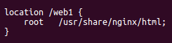
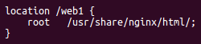
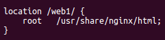
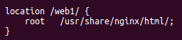
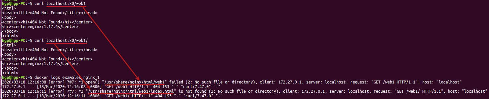

### nginx代理访问路径的问题

* 亲测. location与root静态资源路径的问题, 无论双方路径末尾加不加斜杠, nginx都会在root路径后面再拼接location路径访问资源

```
location /web1 {
    root   /usr/share/nginx/html;
}

location /web1 {
    root   /usr/share/nginx/html/;
}

location /web1/ {
    root   /usr/share/nginx/html;
}

location /web1/ {
    root   /usr/share/nginx/html/;
}

curl localhost:80/web1
curl localhost:80/web1/
```
* 访问情况如下  

  
  
  
  


* 亲测. proxy_pass代理时的路径问题, 只有两种情况, location的URL末尾加不加斜杠, 没影响
* * proxy_pass 末尾不加斜杠, location后面的URL 会 拼接到 proxy_pass 后面
* * proxy_pass 末尾加斜杠, location后面的URL 不会 拼接到 proxy_pass 后面
```
location /api {
    proxy_pass http://10.10.4.5:8088;  // proxy_pass末尾没有斜杠, 代理到10.10.4.5时, 会拼接路径, 访问本机的/api路径会代理到 http://10.10.4.5:8088/api
}

location /api {
    proxy_pass http://10.10.4.5:8088/; // proxy_pass末尾有斜杠, 代理到10.10.4.5时, 不会拼接路径, 访问本机的/api路径会代理到 http://10.10.4.5:8088
}
```