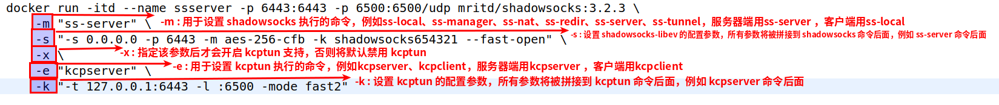

## shadowsocks

#### 参数说明
  

* -m : 用于设置 shadowsocks 执行的命令，例如ss-local、ss-manager、ss-nat、ss-redir、ss-server、ss-tunnel，服务器端用ss-server ，客户端用ss-local
* -s : 设置 shadowsocks-libev 的配置参数，所有参数将被拼接到 shadowsocks 命令后面，例如 ss-server 后
* -x : 指定该参数后才会开启 kcptun 支持，否则将默认禁用 kcptun
* -e : 用于设置 kcptun 执行的命令，例如kcpserver、kcpclient，服务器端用kcpserver ，客户端用kcpclient
* -k : 设置 kcptun 的配置参数，所有参数将被拼接到 kcptun 命令后面，例如 kcpserver 命令后面
* -r : 修复在 GCE 上可能出现的 This system doesn't provide enough entropy to quickly generate high-quality random numbers. 错误

##### 服务端
```
# 不用kcptun加速的情况下的命令
docker run --restart always -dt --name ssserver -p 6443:6443 mritd/shadowsocks:3.2.3 -m "ss-server" -s "-s 0.0.0.0 -p 6443 -m aes-256-cfb -k shadowsocks654321"
## 上面命令相当于下面这条
# ss-server -s 0.0.0.0 -p 6443 -m aes-256-cfb -k shadowsocks654321

## docker run --restart always -itd --name ssserver -p 6443:6443 -p 6500:6500/udp mritd/shadowsocks:3.2.3 -m "ss-server" -s "-s 0.0.0.0 -p 6443 -m aes-256-cfb -k shadowsocks654321" -x -e "kcpserver" -k "-t 127.0.0.1:6443 -l :6500 -mode fast2"

docker run --restart always -itd --name ssserver -p 6443:6443 -p 6500:6500/udp mritd/shadowsocks:3.2.3 \
    -m "ss-server" \
    -s "-s 0.0.0.0 -p 6443 -m aes-256-cfb -k shadowsocks654321" \
    -x \
    -e "kcpserver" \
    -k "-t 127.0.0.1:6443 -l :6500 -mode fast2"

## 上面命令相当于下面两条命令
# ss-server -s 0.0.0.0 -p 6443 -m aes-256-cfb -k shadowsocks654321
# kcpserver -t 127.0.0.1:6443 -l :6500 -mode fast2
```

##### 客户端，ubuntu用docker容器作为客户端后，浏览器还是访问不了 www.google.com
```
# docker run --restart always -itd --name ssclient -p 1080:1080 mritd/shadowsocks:3.2.3 -m "ss-local" -s "-s 127.0.0.1 -p 6500 -b 0.0.0.0 -l 1080 -m aes-256-cfb -k shadowsocks654321 --fast-open" -x -e "kcpclient" -k "-r 服务器IP:6500 -l :6500 -mode fast2"
docker run --restart always -itd --name ssclient -p 1080:1080 mritd/shadowsocks:3.2.3 -m "ss-local" -s "-s 127.0.0.1 -p 6500 -b 0.0.0.0 -l 1080 -m aes-256-cfb -k shadowsocks654321 --fast-open" -x -e "kcpclient" -k "-r 66.42.110.112:6500 -l :6500 -mode fast2"
```

