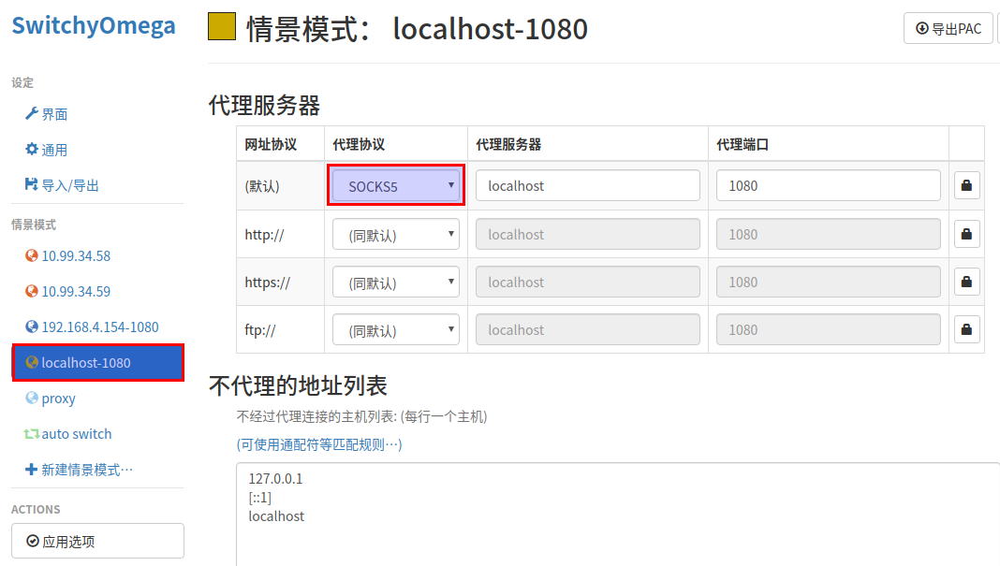

#### 不知道是不是之前的加密方式有问题，还是版本有问题，docker的client端一直访问不了，但是用Windows配置kcpclient却可以。现在用下面命令时，docker的client端又可以了
> server端
```
docker run --restart always -itd --name ssserver -p 6443:6443 -p 6500:6500/udp mritd/shadowsocks:3.3.3-20191229 -m "ss-server" -s "-s 0.0.0.0 -p 6443 -m chacha20-ietf-poly1305 -k testchacha654321" -x -e "kcpserver" -k "-t 127.0.0.1:6443 -l :6500 -mode fast2"
```

> client端
```
docker run --restart always -itd --name ssclient -p 1080:1080 mritd/shadowsocks:3.3.3-20191229 -m "ss-local" -s "-s 127.0.0.1 -p 6500 -b 0.0.0.0 -l 1080 -m chacha20-ietf-poly1305 -k testchacha654321" -x -e "kcpclient" -k "-r SERVER_IP:6500 -l :6500 -mode fast2"
```

* chrome浏览器的SwitchyOmega配置截图
