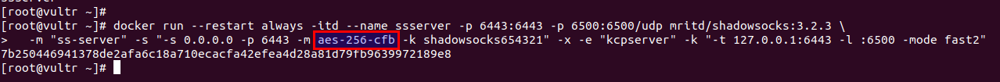
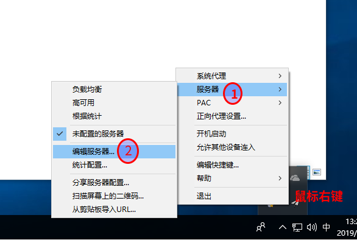
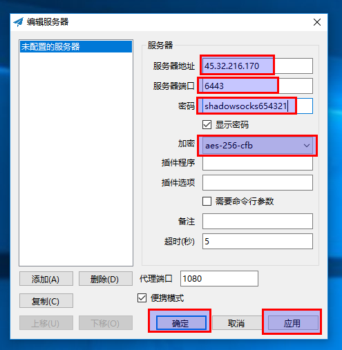
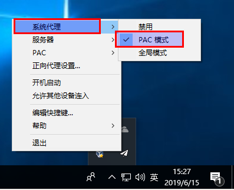
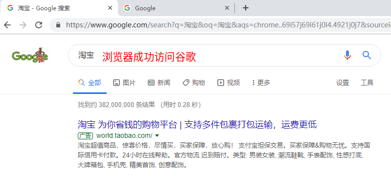
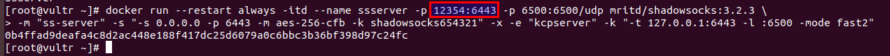
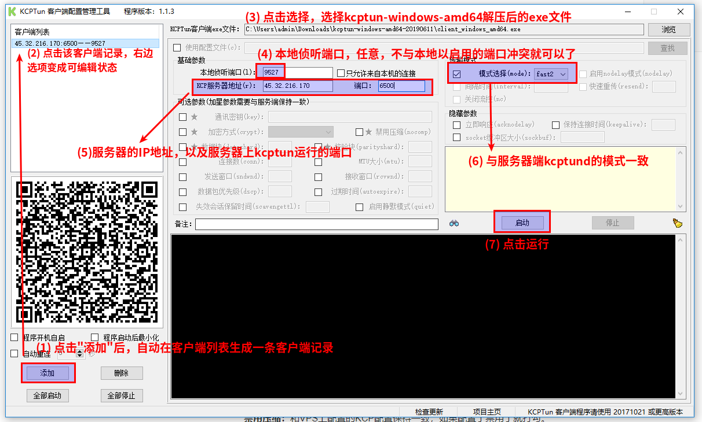
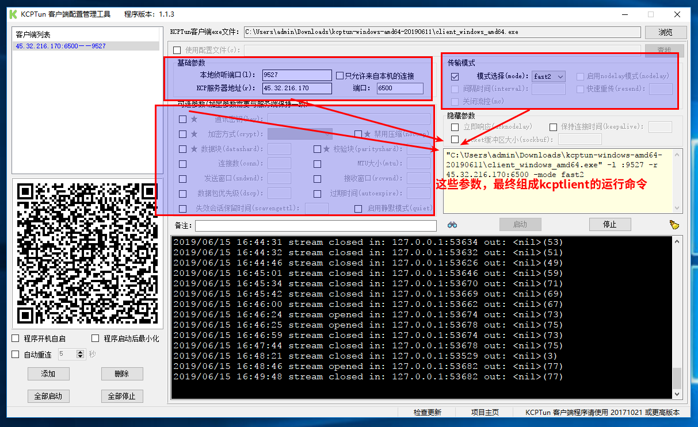
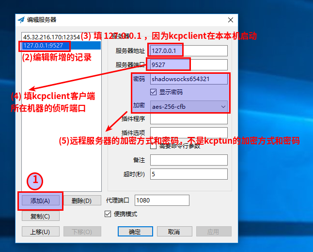

# 列出完整的真实示例，下面的例子都成功访问过谷歌。但是参数什么意思，不是很懂

* 客户端下载地址 https://github.com/shadowsocks/shadowsocks-windows/releases  
* 在全局模式下，所有的网站都默认走代理（所有http/socks数据经过代理服务器的转发送出）  
* 在PAC模式下，只有被墙了的网站才会走代理（连接网站的时候读取PAC文件里的规则，来确定你访问的网站有没有被墙，如果符合，那就会使用代理服务器连接网站）  
  
## 例子一
##### 服务端的操作。在服务器运行下面的命令
```
docker run --restart always -itd --name ssserver -p 6443:6443 -p 6500:6500/udp mritd/shadowsocks:3.2.3 -m "ss-server" -s "-s 0.0.0.0 -p 6443 -m aes-256-cfb -k shadowsocks654321" -x -e "kcpserver" -k "-t 127.0.0.1:6443 -l :6500 -mode fast2"
```

##### Windows客户端的操作截图
* 步骤一: 鼠标右键小飞机图标，依次操作 "服务器" -> "编辑服务器" -> 输入服务器信息 -> 保存
* 步骤二: 鼠标右键小飞机图标，依次点击 "系统代理" -> "PAC模式"
  
  
  
  

* windows 下 shadowsocks-windows 客户端的配置，配置完之后，可以直接访问 www.google.com


<br><br><br><br><br>
## 例子二
* 用服务器的非6443端口，会比6443端口快，不知道是不是错觉
```
docker run --restart always -itd --name ssserver -p 12354:6443 -p 6500:6500/udp mritd/shadowsocks:3.2.3 -m "ss-server" -s "-s 0.0.0.0 -p 6443 -m aes-256-cfb -k shadowsocks654321" -x -e "kcpserver" -k "-t 127.0.0.1:6443 -l :6500 -mode fast2"
```



<br><br><br><br><br>
## 例子三，Windows客户端使用kcpclient加速
##### 服务端的操作。在服务器运行下面的命令
```
docker run --restart always -itd --name ssserver -p 12354:6443 -p 6500:6500/udp mritd/shadowsocks:3.2.3 -m "ss-server" -s "-s 0.0.0.0 -p 6443 -m aes-256-cfb -k shadowsocks654321" -x -e "kcpserver" -k "-t 127.0.0.1:6443 -l :6500 -mode fast2"
```
##### Windows客户端的操作步骤
* 准备三个windows客户端软件：kcptun_gclient（kcptun windows配置工具），kcptun-windows-amd64（kcptun window 客户端），shadowsocks客户端
> * kcptun_gclient下载地址是 https://github.com/dfdragon/kcptun_gclient/releases ，下载 kcptun_gclientv.1.1.3.zip 版本，最后一次更新是在 2017年，现在过去了两年都没更新过  
> * kcptun-windows-amd64下载地址是 https://github.com/xtaci/kcptun/releases/ ，下载 kcptun-windows-amd64-20190611.tar.gz 或者最新版本  
> * shadowsocks客户端下载地址 https://github.com/shadowsocks/shadowsocks-windows/releases ，下载Shadowsocks-4.1.6.zip 或者最新版本  

##### 解压那三个windows客户端软件，其中 kcptun-windows-amd64-20190611.tar.gz 解压就可以了，不需要点击运行，不需要主动设置参数

 * 运行 kcptun_gclientv.1.1.3.zip 解压后的exe文件，配置参数
  
  
> 本地侦听端口:4433  (随便填写，kcpclient运行时占用的端口)  
> kcp服务器地址：SS服务器地址  
> 加密方式：KCP服务器配置加密方式（不是SS服务器的加密方式）  
> 禁用压缩：和KCP服务器配置配置保持一致，如果配置了禁用了就打勾  
> 模式选择(mode): 和KCP服务器配置的模式一致  
 * 运行 Shadowsocks-4.1.6.zip 解压后的exe文件，配置参数  
  

> 服务器IP：127.0.0.1
> 服务器端口：4433（和前面一样就行）
> 密码：填写SS服务器的密码
> 加密方式：SS服务器的加密方式（不是前面的KCP加密方式）