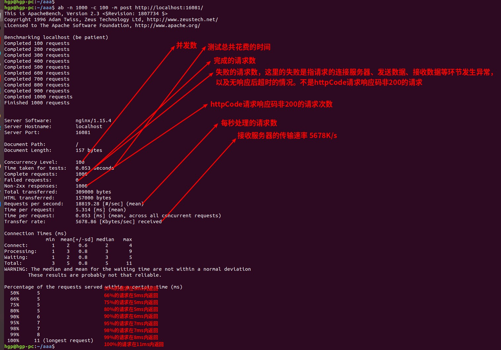

### 了解 ab 配置参数的缺陷，就会少很多异想天开，就不会再去纠结配置完美无敌的参数
- 缺陷1：配置 -t 限制测试的总时间参数后，此时 -n 请求总次数无论设置什么值都不生效，都会发50000次请求
- 缺陷2：不能像curl一样，直接在命令设置请求体的json参数
- 缺陷3：好像只能设置 post和put 两种类型的请求体参数，不能设置delete，patch请求体参数

* 参数说明
```
-m： 指定GET，POST，PUT，DELETE请求方式，必须是大写字母
-n ：总共的请求执行数，缺省是1；运行 ab -c 100 http://localhost:16081/  命令提示 并发数大于请求数，命令直接抛错
-c： 并发数，缺省是1；
-t：限制测试的总时间，单位是秒，压测超过限制时间会终止(即使总请求次数还没执行完)，此时 -n 请求总次数无论设置什么值都不生效，都会发50000次请求
-p：在文件设置post请求体的参数
-p：在文件设置put请求体的参数
-H：设置请求头参数，例如token，编码Accept-Encoding:zip
-w: 以HTML表的格式输出结果
```

#### 例子
* 设置总请求数-n 和并发数-c 的大小
```
ab -n 100000 -c 100 -m GET http://localhost:16081/
```
* 设置总的测试时间 -t 和并发数 -c 的大小，此时 -n 请求总次数无论设置什么值都不生效，都会发50000次请求
```
ab  -c 100 -t 10 -m GET http://localhost:16081/
```
* 发送post请求，指定请求体参数格式是application/json，设置总请求数-n 和并发数-c 的大小
```
echo '{"id":"uuid","name":"名称"}' > requestBody.txt
ab  -n 100 -c 10 -p requestBody.txt -T application/json http://localhost:16081/
```
* 指定请求头参数，例如token信息
```
ab -n 100000 -c 100 -m GET -H "token:token1" -H "Accept-Encoding:zip" http://localhost:16081/
```



### 测试结果
```
hgp@hgp-pc:~/aaa$ ab -n 1000 -c 100 -m GET http://localhost:16081/

Benchmarking localhost (be patient)
Completed 200 requests
Completed 400 requests
Completed 600 requests
Completed 800 requests
Completed 1000 requests
Finished 1000 requests


Server Software:        nginx/1.15.4         web服务器软件及版本
Server Hostname:        localhost             表示请求的URL中的主机部分名称
Server Port:            16081                            被测试的Web服务器的监听端口

Document Path:          /                              请求的页面路径
Document Length:        9395 bytes       页面大小

Concurrency Level:      100                        并发数
Time taken for tests:   0.077 seconds   测试总共花费的时间
Complete requests:      1000                     完成的请求数
Failed requests:        0                                  失败的请求数，这里的失败是指请求的连接服务器、发送数据、接收数据等环节发生异常，以及无响应后超时的情况。不是httpCode请求响应码非200的请求
Non-2xx responses:      1000                    httpCode请求响应码非200的请求次数
Total transferred:      9653000 bytes     总共传输字节数，包含http的头信息等。使用ab的-v参数即可查看详细的http头信息。
HTML transferred:       9395000 bytes     html字节数，实际的页面传递字节数。也就是减去了Total transferred中http响应数据中头信息的长度。
Requests per second:    12981.28 [#/sec] (mean)      每秒处理的请求数，吞吐率为12981.28
Time per request:       7.703 [ms] (mean)                      平均数，用户平均请求等待时间
Time per request:       0.077 [ms] (mean, across all concurrent requests)   服务器平均处理时间
Transfer rate:          122371.39 [Kbytes/sec] received                                平均传输速率（每秒收到的速率）。可以很好的说明服务器在处理能力达到限制时，其出口带宽的需求量。

Connection Times (ms)
              min  mean[+/-sd] median   max
Connect:        0    0   0.9      0       5
Processing:     2    7   1.1      7       9
Waiting:        1    7   1.1      7       9
Total:          6    7   0.7      7      11

Percentage of the requests served within a certain time (ms)
  50%      7      ## 50%的请求在7ms内返回
  66%      7     ## 66%的请求在7ms内返回
  75%      7     ## 75%的请求在7ms内返回
  80%      8     ## 80%的请求在8ms内返回
  90%      8     ## 90%的请求在8ms内返回
  95%      9     ## 95%的请求在9ms内返回
  98%      9    ## 98%的请求在9ms内返回
  99%     10    ## 99%的请求在10ms内返回
 100%     11 (longest request)    ## 99%的请求在11ms内返回
```