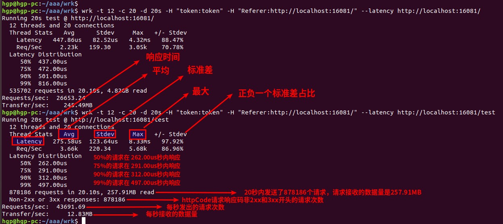

### 了解 wrk 配置参数的优缺点，就会少很多异想天开，就不会再去纠结配置完美无敌的参数
- 优点1：支持客户端多线程操作，充分利用客户端多核CPU的能力。
- 优点2：基于epoll模式，意味着我们可以用少量的线程来跟被测服务创建大量连接，进行压测。
- 优点3：比 ab 功能更加强大，并且可以支持lua脚本来创建复杂的测试场景。对于我来说太复杂了，学习成本大于上天了。。。
- 缺陷1：好像不支持post，put请求，没找到例子，可能是自己太菜了

```
# 国外仓库
# git clone https://github.com/wg/wrk.git
# 国内仓库
git clone https://gitee.com/hegp/wrk.git
cd wrk
make
sudo cp wrk /usr/local/bin/wrk
```

#### 参数说明
```
-t 需要模拟的线程数
-c 需要模拟的连接数
-d 测试的持续时间
-H 添加请求头部
```

#### 例子，要谨慎，压测可能会导致局域网内美妙产生几十或者几百兆的流量
```
wrk -t 12 -c 20 -d 20s -H "token:token" -H "Referer:http://localhost:16081/"--latency http://localhost:16081/
```



#### 运行结果
```
hgp@hgp-pc:~/aaa/wrk$ wrk -t 12 -c 20 -d 20s -H "token:token" -H "Referer:http://localhost:16081/" --latency http://localhost:16081/
Running 20s test @ http://localhost:16081/
  12 threads and 20 connections
  Thread Stats   Avg      Stdev     Max   +/- Stdev
    Latency   447.86us   82.52us   4.32ms   88.47%
    Req/Sec     2.23k   159.30     3.05k    70.78%
  Latency Distribution
     50%  437.00us
     75%  472.00us
     90%  501.00us
     99%  816.00us
  535702 requests in 20.10s, 4.82GB read
Requests/sec:  26653.24
Transfer/sec:    245.49MB
hgp@hgp-pc:~/aaa/wrk$ wrk -t 12 -c 20 -d 20s -H "token:token" -H "Referer:http://localhost:16081/" --latency http://localhost:16081/test
Running 20s test @ http://localhost:16081/test
  12 threads and 20 connections
  Thread Stats   Avg      Stdev     Max   +/- Stdev
    Latency   275.58us  123.64us   8.33ms   97.92%
    Req/Sec     3.66k   220.34     5.68k    86.96%
  Latency Distribution
     50%  262.00us
     75%  291.00us
     90%  312.00us
     99%  497.00us
  878186 requests in 20.10s, 257.91MB read
  Non-2xx or 3xx responses: 878186
Requests/sec:  43691.69
Transfer/sec:     12.83MB
hgp@hgp-pc:~/aaa/wrk$ 
```

##### 运行结果参数说明
```
Latency：响应时间
Req/Sec：每个线程每秒钟的完成的请求数
Avg：平均
Max：最大
Stdev：标准差
+/- Stdev： 正负一个标准差占比
```