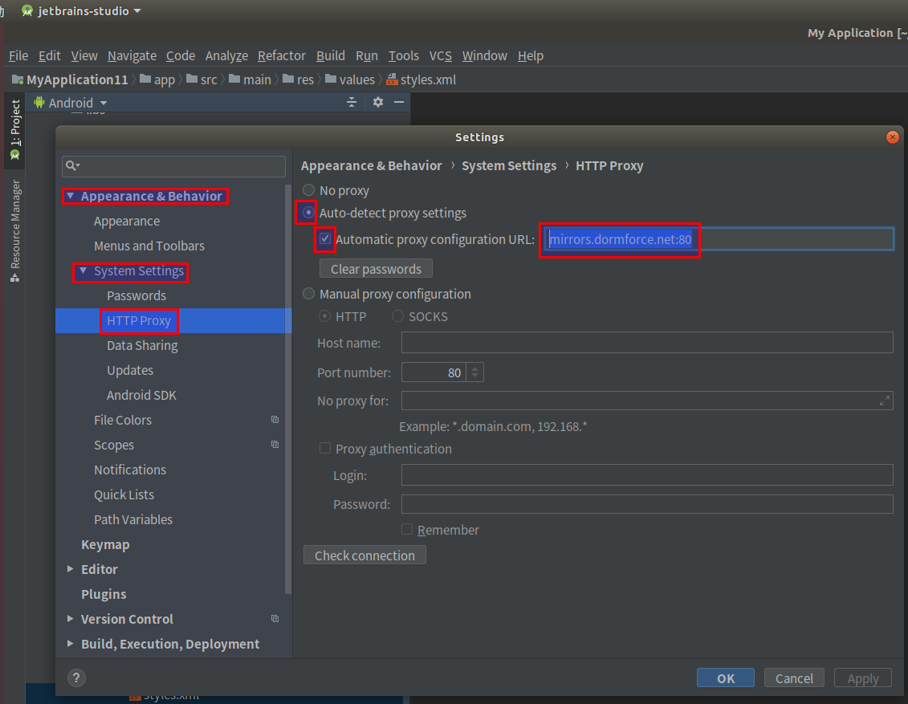

## Ubuntu搭建React-native-cli环境，禁止安装 react-native，抛了无数次  文件的SHA-1值 not compute，模拟机死活安装不了app
##### 操作步骤
* 安装nodejs，好像react-native需要10.x版本以上的nodejs
* 配置好 npm，cnpm，yarn的仓库源
* 安装Java8
* 安装Android Studio开发工具
* 配置Android SDK
* 配置完Android SDK后，配置一个Android模拟机
* 源码编译安装watchman
* 给 /etc/sysctl.conf 文件配置系统参数
* 安装 react-native 插件，并创建项目

#### 安装nodejs，好像react-native需要10.x版本以上的nodejs
```
echo "deb http://mirrors.aliyun.com/ubuntu/ $(lsb_release -cs) main restricted universe multiverse" > /etc/apt/sources.list
echo "deb http://mirrors.aliyun.com/ubuntu/ $(lsb_release -cs)-security main restricted universe multiverse" >> /etc/apt/sources.list
echo "deb http://mirrors.aliyun.com/ubuntu/ $(lsb_release -cs)-updates main restricted universe multiverse" >> /etc/apt/sources.list
echo "deb http://mirrors.aliyun.com/ubuntu/ $(lsb_release -cs)-proposed main restricted universe multiverse" >> /etc/apt/sources.list
echo "deb http://mirrors.aliyun.com/ubuntu/ $(lsb_release -cs)-backports main restricted universe multiverse" >> /etc/apt/sources.list

# 下面这句一定要运行，否则会认为国内node加速下载地址是不可信，导致不在国内加速器下载最新版本
curl -s https://deb.nodesource.com/gpgkey/nodesource.gpg.key | sudo apt-key add -
# 安装 10.X版本
echo "deb https://mirrors.tuna.tsinghua.edu.cn/nodesource/deb_10.x $(lsb_release -cs) main" > /etc/apt/sources.list.d/nodesource.list
echo "deb-src https://mirrors.tuna.tsinghua.edu.cn/nodesource/deb_10.x $(lsb_release -cs) main" >> /etc/apt/sources.list.d/nodesource.list
cat /etc/apt/sources.list.d/nodesource.list 
apt-get update
apt-get install nodejs
node -v
```

### 修改 npm 安装插件的目录是 当前用户的 ~/.npm-global目录，用root用户执行下面的命令
```
npm config set prefix '~/.npm-global'
mkdir -p /etc/profile.d
echo "#set npm environment" > /etc/profile.d/npm-config.sh
echo 'export PATH=~/.npm-global/bin:$PATH' >> /etc/profile.d/npm-config.sh
chmod 755 /etc/profile.d/npm-config.sh
source /etc/profile
```

#### 配置好 npm，cnpm，yarn的仓库源
```
npm config set registry https://registry.npm.taobao.org --verbose
npm install -g npm --verbose
npm -v
npm install -g cnpm --registry=https://registry.npm.taobao.org --verbose
cnpm -v
npm install -g yarn --verbose
# 修改yarn源为淘宝源
yarn config set registry https://registry.npm.taobao.org/
# 修改yarn源为官方源
# yarn config set registry https://registry.yarnpkg.com
```

#### 自行百度安装Java8

#### 安装Android Studio
> Android Studio的官网下载地址是  https://developer.android.google.cn/studio/ ，下载要翻墙，或者去百度云盘找自己的Ubuntu一键安装脚本

#### 配置Android SDK
* 比较可悲的现实，网上安装android sdk教程的都是2015年前，是android4.x版本的，没有最新版的安装教程，可悲，只能通过 Android Studio 配置安装Android SDK
> 按照步骤打开 File -> Setting -> Appearance & Behavior -> System Settings -> HTTP Proxy 配置代理地址  mirrors.dormforce.net:80  



> 按照步骤打开 File -> Setting -> Appearance & Behavior -> System Settings -> Android SDK 设置 安卓SDK存放的路径/opt/soft/Android/sdk，同时把该路径加入环境变量
```
mkdir -p /etc/profile.d
tee /etc/profile.d/android.sh <<-'EOF'
export ANDROID_HOME=/opt/soft/Android/sdk
export PATH=$PATH:$ANDROID_HOME/tools:$ANDROID_HOME/tools/bin:$ANDROID_HOME/platform-tools:$ANDROID_HOME/emulator
EOF
chmod a+x /etc/profile.d/android.sh
source /etc/profile
```


#### 配置完Android SDK后，配置一个Android模拟机

> 编译 React Native 应用需要的是Android 9 (Pie)版本的 SDK
> 如果出现 /dev/kvm device: permission denied ，给当前用户授权 chown 用户名 /dev/kvm ，也可以配置一个开机授权的脚本
> 创建一个Android模拟机


#### watchman源码编译安装
```
sudo apt-get install -y libtool libssl-dev
git clone https://gitee.com/hegp/watchman.git
cd watchman
git checkout v4.9.0
./autogen.sh
./configure
make
sudo make install
watchman -v
```

#### 给 /etc/sysctl.conf 文件配置系统参数
```
# 添加参数 fs.inotify.max_user_instances=51200 ，若 fs.inotify.max_user_instances 存在，修改参数值
# 添加参数 fs.inotify.max_user_watches=65536 ，若 fs.inotify.max_user_watches 存在， 修改参数值
# 添加参数 fs.inotify.max_queued_events=32768 ，若 fs.inotify.max_queued_events 存在， 修改参数值
# 执行下面命令，让参数生效
/sbin/sysctl -p
```

### 无尽的噩梦，不知道是不是 watchman 识别不了react-native打包失败的缓存文件，模拟机老是显示 文件的 SHA-1值 not compute
### 无尽的噩梦，如果执行 adb devices 命令遇到模拟器报 emulator unauthorized 错误，下面有几种解决方案
> 删除root用户的 adbkey.pub 和 adbkey ， 以及当前用户的 adbkey.pub 和 adbkey
```
# root用户的
sudo rm -rf /root/.android/adbkey.pub /root/.android/adbkey
# 当前用户的
rm -rf ~/.android/adbkey.pub ~/.android/adbkey
```
> 在 Android Studio 可视化界面的AVD Manager界面删除 emulator 模拟机

# 如果是垃圾工具，官方请不要发布出来，不是每个人都是神，都知道怎么解决，我们普通人是在用生命，用光阴去试错，直到有朝一天生命耗尽，人死了才解脱，安装 npm install -g react-native --verbose 工具后，每次创建项目跑 react-native run-android 命令都抛错，在模拟机跑不起来，浪费了无数的生命和光阴，改成 npm install -g react-native-cli --verbose 工具后，又可以跑起来
## 无尽的噩梦，安装 react-native 模块创建的项目在安卓跑起来的时候哦，每执行一次 react-native run-android 命令，就抛一次错误，在模拟机上完全跑不起来， error: bundling failed: ReferenceError: SHA-1 for file /home/hgp/.npm-global/lib/node_modules/react-native/node_modules/metro/src/lib/polyfills/require.js (/home/hgp/.npm-global/lib/node_modules/react-native/node_modules/metro/src/lib/polyfills/require.js) is not computed
#### 安装 react-native 插件，并创建项目
```
npm install -g react-native-cli --verbose
mkdir -p react-native-20200102 && cd react-native-20200102
# 创建项目，等待几分钟
react-native init test
cd test
# 执行下面命令，保持这条命令存活，再新开一个窗口，这条命令默认占用 8081 端口，安装 npm install -g react-native --verbose 工具，每次执行 react-native start -- --reset-cache命令，都会提示文件的SHA-1值 not compute，在模拟机死活安装不了app
react-native start -- --reset-cache
# 新开窗口，执行下面命令
# 修改项目的gradle仓库   maven { url "http://maven.aliyun.com/nexus/content/groups/public" }
react-native run-android
# 指定设备ID运行
# npm install --verbose && react-native run-android --deviceId emulator-5554
```