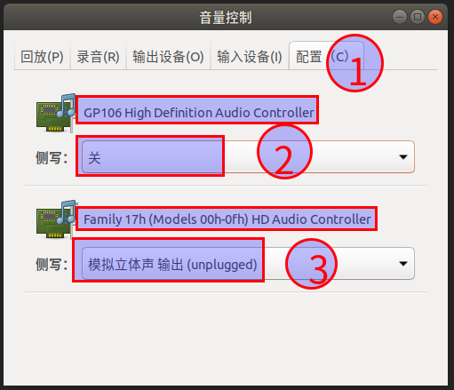
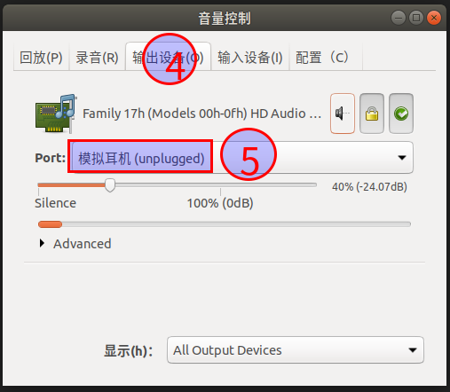
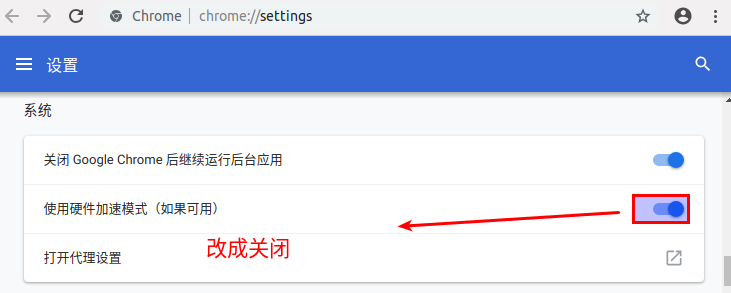

## 都切换到root用户进行命令操作

### 默认情况下，root用户没有拥有 /etc/profile环境变量，要在 ~/.bashrc 添加 source /etc/profile 的命令
```
echo "source /etc/profile" >> ~/.bashrc
```

### 删除LibreOffice
```
sudo apt remove -y libreoffice-calc libreoffice-draw libreoffice-impress libreoffice-writer libreoffice*
```

### 禁止 apt-daily 服务
```
systemctl disable apt-daily.service
systemctl disable apt-daily.timer
```

### 配置阿里云加速器
```
echo "deb http://mirrors.aliyun.com/ubuntu/ $(lsb_release -cs) main restricted universe multiverse" > /etc/apt/sources.list
echo "deb http://mirrors.aliyun.com/ubuntu/ $(lsb_release -cs)-security main restricted universe multiverse" >> /etc/apt/sources.list
echo "deb http://mirrors.aliyun.com/ubuntu/ $(lsb_release -cs)-updates main restricted universe multiverse" >> /etc/apt/sources.list
echo "deb http://mirrors.aliyun.com/ubuntu/ $(lsb_release -cs)-proposed main restricted universe multiverse" >> /etc/apt/sources.list
echo "deb http://mirrors.aliyun.com/ubuntu/ $(lsb_release -cs)-backports main restricted universe multiverse" >> /etc/apt/sources.list
apt-get update && apt-get clean && apt-get autoclean
```

### 安装python-3.7 (阿里源仓库有python3.7的安装包)
```
apt-get install -y python3.7-dev
apt-get install -y python3.7
apt-get install -y python3-pip

# 设置python3.7为默认版本
rm -rf /usr/bin/python
ln -s /usr/bin/python3.7 /usr/bin/python

wget https://bootstrap.pypa.io/get-pip.py
python get-pip.py

# 在root用户下执行一次，在普通用户下执行一次
mkdir -p ~/.pip
echo "[global]" > ~/.pip/pip.conf
echo "index-url=http://mirrors.aliyun.com/pypi/simple/" >> ~/.pip/pip.conf
echo "[install]" >> ~/.pip/pip.conf
echo "trusted-host=mirrors.aliyun.com" >> ~/.pip/pip.conf

```

### 安装ssh
```
# 查看是否已经安装ssh
ps -e | grep ssh
apt-get install -y openssh-server

# 配置sshd参数
cat /etc/ssh/sshd_config | grep PubkeyAuthentication
cat /etc/ssh/sshd_config | grep PasswordAuthentication
cat /etc/ssh/sshd_config | grep UseDNS
cat /etc/ssh/sshd_config | grep GSSAPIAuthentication
cat /etc/ssh/sshd_config | grep PermitRootLogin
sed -ri 's/^#?PubkeyAuthentication\s+.*/PubkeyAuthentication yes/' /etc/ssh/sshd_config ;
sed -ri 's/^PasswordAuthentication\s+.*/PasswordAuthentication yes/' /etc/ssh/sshd_config ;
sed -ri 's/^GSSAPIAuthentication\s+.*/GSSAPIAuthentication no/' /etc/ssh/sshd_config ;
sed -ri 's/^#PermitRootLogin\s+.*/PermitRootLogin yes/' /etc/ssh/sshd_config ;
cat /etc/ssh/sshd_config | grep PubkeyAuthentication
cat /etc/ssh/sshd_config | grep PasswordAuthentication
cat /etc/ssh/sshd_config | grep GSSAPIAuthentication
cat /etc/ssh/sshd_config | grep PermitRootLogin
systemctl restart sshd
```

### 安装docker
```
# 用root用户安装
mkdir -p /etc/apt/sources.list.d
echo "deb [arch=amd64] https://mirrors.ustc.edu.cn/docker-ce/linux/ubuntu $(lsb_release -cs) stable" > /etc/apt/sources.list.d/aliyun-docker.list

# 添加Docker公共密钥，作用应该是 apt-get 安装 http://mirrors.aliyun.com/docker-ce/linux/ubuntu/ 的docker软件时对比公钥证明仓库是合法的吧
curl -fsSL https://mirrors.aliyun.com/docker-ce/linux/ubuntu//gpg | apt-key add -

apt-get update && apt-get clean && apt-get autoclean && apt-get clean && apt-get autoremove

apt-get install -y docker-ce

mkdir -p /etc/docker
# https://docker.mirrors.ustc.edu.cn 是中国科学技术大学的docker仓库加速器，好像是实时代理的，但是时好时坏
tee /etc/docker/daemon.json <<-'EOF'
{
  "registry-mirrors": ["https://kfp63jaj.mirror.aliyuncs.com"]
}
EOF
systemctl enable docker #设置docker服务开机自启动
systemctl restart docker

# 安装docker-compose
curl -L https://mirrors.aliyun.com/docker-toolbox/linux/compose/1.21.2/docker-compose-`uname -s`-`uname -m` > /usr/local/bin/docker-compose
chmod +x /usr/local/bin/docker-compose

# groupadd docker
# usermod -aG docker hgp
# 这步是必须的，否则因为 groups 命令获取到的是缓存的组信息，刚添加的组信息未能生效，所以 docker ps -a 执行时有错。或者重启系统让用户组信息生效
# newgrp - docker

```

#### buntu系统自带的 vi 不完整导致键盘上下左右键显示为字符的问题
```
sudo apt-get install -y vim-gtk
```

#### 在网上使用 sublime-text_build-3207_amd64.deb 安装包安装, 拒绝使用在线安装sublime-text, 因为不支持中文数据, 要到github下载某个仓库编译, 太麻烦

### 卸载gedit(被gedit坑死过很多次，几十行的文件替换后，再撤销回退，电脑直接卡死，只能拔电源线强制关机，害死人了，打开大文件直接卡死了)
```
# 用root用户执行命令
# 卸载 gedit
apt-get remove gedit
```

### 上官网下载VSCode的deb安装包安装
```
# VSCode下载地址
# https://code.visualstudio.com/Download
sudo dpkg -i code_1.26.1-1534444688_amd64.deb
```

### 安装最新的chrome浏览器
```
wget https://dl.google.com/linux/direct/google-chrome-stable_current_amd64.deb
sudo dpkg -i google-chrome-stable_current_amd64.deb
```

### 安装360浏览器，因为谷歌浏览器越来越严格了，不符合谷歌标准的视频网站看不了视频或者网页打不开，因此安装360浏览器，360没有这么严格
```
# 下载360浏览器的链接  https://bbs.360.cn/thread-15529293-1-1.html
```

### 安装搜狗输入法
```
# 去官网下载搜狗输入法  sogoupinyin_2.2.0.0108_amd64.deb
# wget http://cdn2.ime.sogou.com/dl/index/1524572264/sogoupinyin_2.2.0.0108_amd64.deb
sudo dpkg -i sogoupinyin_2.2.0.0108_amd64.deb
# sudo apt-get install -f -y       # 自动修复包的依赖
sudo apt --fix-broken install -y   # 自动修复包的依赖
sudo dpkg -i sogoupinyin_2.2.0.0108_amd64.deb
# 配置输入法 Setting -> Region & Language -> Manage Installed Languages 把Keboard input method system从IBus修改为fcitx
# 然后直接重启系统
```

### 安装 12.X 版本的nodejs，然后切换回普通用户安装插件
```
# 下面这句一定要运行，否则会认为国内node加速下载地址是不可信，导致不在国内加速器下载最新版本
curl -s https://deb.nodesource.com/gpgkey/nodesource.gpg.key | sudo apt-key add -

echo "deb https://mirrors.tuna.tsinghua.edu.cn/nodesource/deb_12.x $(lsb_release -cs) main" > /etc/apt/sources.list.d/nodesource.list
echo "deb-src https://mirrors.tuna.tsinghua.edu.cn/nodesource/deb_12.x $(lsb_release -cs) main" >> /etc/apt/sources.list.d/nodesource.list
apt-get update
apt-get install -y nodejs

mkdir -p /etc/profile.d
echo "#set npm environment" > /etc/profile.d/npm-config.sh
echo 'export PATH=~/.npm-global/bin:$PATH' >> /etc/profile.d/npm-config.sh
chmod 755 /etc/profile.d/npm-config.sh


# 修改 npm 安装插件的目录是 当前用户的 ~/.npm-global目录
npm config set prefix '~/.npm-global'

# 配置国内加速器
source /etc/profile
npm config set registry https://registry.npm.taobao.org --verbose
npm install -g cnpm --registry=https://registry.npm.taobao.org --verbose
npm install -g yarn --verbose
yarn config set registry https://registry.npm.taobao.org/

# 部分软件单独设置加速地址
npm config set registry https://registry.npm.taobao.org
npm config set sass_binary_site https://npm.taobao.org/mirrors/node-sass/
npm config set phantomjs_cdnurl https://npm.taobao.org/mirrors/phantomjs/
npm config set electron_mirror https://npm.taobao.org/mirrors/electron/
npm config set sqlite3_binary_host_mirror https://npm.taobao.org/mirrors/sqlite3/
npm config set profiler_binary_host_mirror https://npm.taobao.org/mirrors/node-inspector/
npm config set chromedriver_cdnurl https://npm.taobao.org/mirrors/chromedriver/
npm config set puppeteer_download_host=https://npm.taobao.org/mirrors/


yarn config set registry https://registry.npm.taobao.org
yarn config set sass_binary_site https://npm.taobao.org/mirrors/node-sass/
yarn config set phantomjs_cdnurl https://npm.taobao.org/mirrors/phantomjs/
yarn config set electron_mirror https://npm.taobao.org/mirrors/electron/
yarn config set sqlite3_binary_host_mirror https://npm.taobao.org/mirrors/sqlite3/
yarn config set profiler_binary_host_mirror https://npm.taobao.org/mirrors/node-inspector/
yarn config set chromedriver_cdnurl https://npm.taobao.org/mirrors/chromedriver/
yarn config set puppeteer_download_host=https://npm.taobao.org/mirrors/

```

### 安装virtualbox
* 必须安装Linux内核头文件依赖，virtualbox用到Linux内核头文件，否则无法创建网卡或者其他一大堆错误
```
# 查看内核版本 uname -r
# 4.18.0-16-generic
apt-get install build-essential linux-headers-`uname -r`
mkdir -p /etc/apt/sources.list.d
# 使用腾讯云的软件仓库地址，不用官方的仓库地址
# sudo echo "deb http://download.virtualbox.org/virtualbox/debian $(lsb_release -sc) contrib" > /etc/apt/sources.list.d/virtualbox.list
# 使用腾讯云的软件仓库地址
sudo echo "deb http://mirrors.cloud.tencent.com/virtualbox/apt/ $(lsb_release -sc) contrib" > /etc/apt/sources.list.d/virtualbox.list
# 添加 Oracle virtualbox 公钥
wget -q https://www.virtualbox.org/download/oracle_vbox_2016.asc -O- | sudo apt-key add -
apt-get update
apt-get install -y virtualbox-5.2
# 设置 virtualbox 内核模块开机启动
systemctl enable vboxdrv
systemctl restart vboxdrv
# sudo usermod -aG vboxusers 用户名
```

### 安装vagrant
```
# 网上的人说 sudo apt-get install vagrant -y 不支持VirtualBox 5.2版，所以要去官网手动下载安装vagrant二进制包
# 官网下载页 https://www.vagrantup.com/downloads.html
# 安装2.2.4版本
wget https://releases.hashicorp.com/vagrant/2.2.4/vagrant_2.2.4_x86_64.deb
dpkg -i vagrant_2.2.4_x86_64.deb
# sudo apt-get install -f -y        # 自动修复包的依赖
sudo apt --fix-broken -y install    # 自动修复包的依赖
dpkg -i vagrant_2.2.4_x86_64.deb
```

##### 设置dns解析服务器，没配置时，互联网ddns动态IP域名绑定，导致本地还是用了旧的IP地址，重启家里的路由器，按照网上教程刷新dns都不行，搞了一个多小时还没解决，后面在/etc/resolv.conf加了dns解析服务器后，10秒就生效了，域名可以解析到新的IP地址了
```
echo "nameserver 8.8.8.8">> /etc/resolv.conf
echo "nameserver 114.114.114.114">> /etc/resolv.conf
```

### 截图工具
```
apt-get install -y shutter
# shutter在Ubuntu-18.04中不能编辑，要安装下面的依赖
wget https://launchpadlibrarian.net/226687719/libgoocanvas-common_1.0.0-1_all.deb
sudo dpkg -i libgoocanvas-common_1.0.0-1_all.deb
sudo apt --fix-broken -y install    # 自动修复包的依赖
wget https://launchpadlibrarian.net/226687722/libgoocanvas3_1.0.0-1_amd64.deb
sudo dpkg -i libgoocanvas3_1.0.0-1_amd64.deb
sudo apt --fix-broken -y install    # 自动修复包的依赖
wget https://launchpadlibrarian.net/330848267/libgoo-canvas-perl_0.06-2ubuntu3_amd64.deb
sudo dpkg -i libgoo-canvas-perl_0.06-2ubuntu3_amd64.deb
sudo apt --fix-broken -y install    # 自动修复包的依赖
```

### 安装钉钉 [https://github.com/nashaofu/dingtalk/releases/]
### 安装Navicat，到百度云找安装包

### 安装WPS，另外在网上下载相应字体，避免找不到字体抛错
```
# 下载WPS安装包
http://wps-community.org/download.html
```

### 更新驱动，然后重启
```
sudo ubuntu-drivers autoinstall
reboot
```

### 安装filezilla
```
sudo apt-get install -y filezilla
```

### ubuntu18.04 没声音解决方案
```
sudo apt install -y pavucontrol
sudo pavucontrol
```
* 配置步骤，图片演示  
  
  

### 视频播放器 smplayer
```
sudo apt-get install -y smplayer
```

### 视频播放器 vlc
```
sudo apt-get install -y vlc
```

### 安装kazam录屏软件
```
sudo apt-get install -y kazam
# 启动软件
kazam
```

### 安装 audacious 音乐播放器
```
sudo apt-get install -y audacious
# 解决乱码的操作，在导航菜单依次点击  文件 -> 设置 -> 播放列表 -> 自动检测下拉编码 -> 选中汉语
# 解决乱码的操作，在导航菜单依次点击  文件 -> 设置 -> 播放列表 -> 备用字符编码 -> 输入 GBK
```

### 解决Ubuntu的SSH自动断线问题
```
# 依赖ssh客户端定时发送心跳检测，配置/etc/ssh/ssh_config文件，在末尾添加上
ServerAliveInterval 20
ServerAliveCountMax 999

# ServerAliveInterval 20        # 每隔20秒向服务器发出一次心跳检测
# ServerAliveCountMax 999 # 若超过50次请求都没有成功，就主动断开与服务器端的连接
```

### 安装Ubuntu远程连接windows的软件rdesktop
```
sudo apt-get install -y rdesktop
```

### 安装shadowsocks，Ubuntu-18.04(2019年4月2号，此时还没有Ubuntu-18.04-bionic的版本，只能用Ubuntu-16.04-xenial版本)，适用于Ubuntu-16.04
```
# sudo add-apt-repository ppa:hzwhuang/ss-qt5 必须执行这句，否则安装shadowsocks-qt5，会提示 "由于没有公钥，无法验证下列签名"
sudo add-apt-repository ppa:hzwhuang/ss-qt5
sudo echo 'deb http://ppa.launchpad.net/hzwhuang/ss-qt5/ubuntu xenial main' > /etc/apt/sources.list.d/hzwhuang-ubuntu-ss-qt5-bionic.list
sudo apt-get update
sudo apt-get install -y --allow-unauthenticated shadowsocks-qt5
```

### 安装wine
```
# 以root用户运行下面的命令，如果运行有错，复制粘贴重新运行几遍，直到成功为止
sudo dpkg --add-architecture i386
sudo apt install -y wine-development
wine --version     #如果出现wine的版本则说明安装成功
sudo apt install winbind
```

### 禁止chrome硬件加速
  

### Ubuntu-18.04试了几十次登录，输入正确密码后，直接卡死在红色的界面，进入不了系统，一动不能动，只能强制按电源键断电
```
sudo apt-get remove -y plymouth xserver-xorg-video-intel
sudo apt-get install -y lightdm
sudo dpkg-reconfigure lightdm
# 弹出一个命令行窗口选择项，把  gdm3  改成  lightdm
sudo apt-get install ubuntu-desktop
# 然后重启，系统能登录了
reboot
```

### Ubuntu-18.04鼠标移动卡顿，有时候不能移动
```
sudo apt-get install -y xserver-xorg-input-all
sudo apt-get install --reinstall xserver-xorg-input-all
```

### 安装wine
```
sudo apt-add-repository --remove https://dl.winehq.org/wine-builds/ubuntu/
sudo apt-add-repository "deb https://dl.winehq.org/wine-builds/ubuntu/ bionic main"
```

### 安装C语言开发环境
```
apt-get install -y build-essential
```


### 禁用系统的 Ctrl+Alt+左箭头 和 Ctrl+Alt+右箭头 快捷键，网上说 Ctrl+Alt+箭头 的快捷键被 gnome3 占用了
```
# 查看组合键是否还被系统占用
gsettings get org.gnome.desktop.wm.keybindings switch-to-workspace-left
gsettings get org.gnome.desktop.wm.keybindings switch-to-workspace-right
gsettings get org.gnome.desktop.wm.keybindings switch-to-workspace-up
gsettings get org.gnome.desktop.wm.keybindings switch-to-workspace-down

# 将 gnome3快捷键置空
gsettings set org.gnome.desktop.wm.keybindings switch-to-workspace-left "[]"
gsettings set org.gnome.desktop.wm.keybindings switch-to-workspace-right "[]"
gsettings set org.gnome.desktop.wm.keybindings switch-to-workspace-up "[]"
gsettings set org.gnome.desktop.wm.keybindings switch-to-workspace-down "[]"

# 输入ROOT密码，在root模式下也设置禁用
su -

gsettings set org.gnome.desktop.wm.keybindings switch-to-workspace-left "[]"
gsettings set org.gnome.desktop.wm.keybindings switch-to-workspace-right "[]"
gsettings set org.gnome.desktop.wm.keybindings switch-to-workspace-up "[]"
gsettings set org.gnome.desktop.wm.keybindings switch-to-workspace-down "[]"

# 查看组合键是否还被系统占用
gsettings get org.gnome.desktop.wm.keybindings switch-to-workspace-left
gsettings get org.gnome.desktop.wm.keybindings switch-to-workspace-right
gsettings get org.gnome.desktop.wm.keybindings switch-to-workspace-up
gsettings get org.gnome.desktop.wm.keybindings switch-to-workspace-down
```