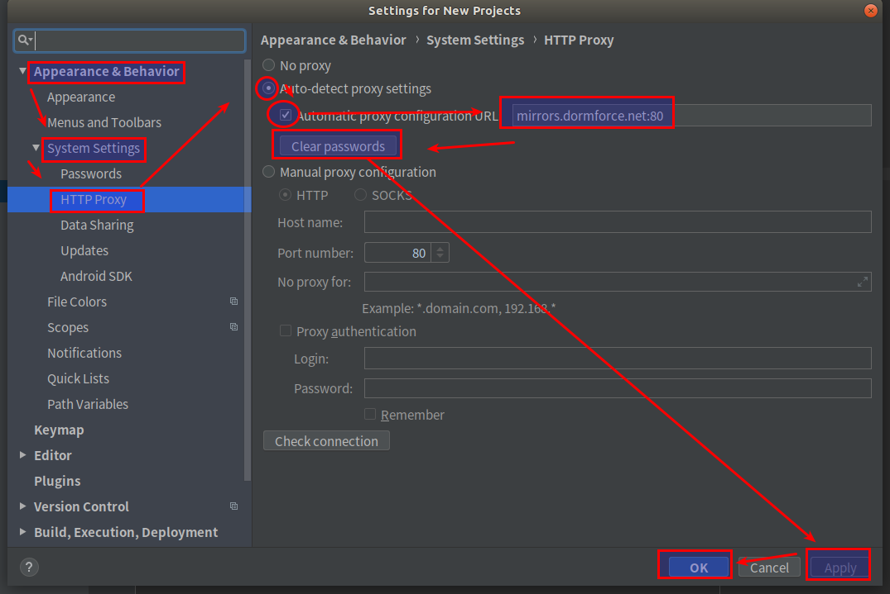

## ubuntu-18.04配置android-studio开发环境, 适合有经验的Linux开发者的教程
* 只需要下载android-studio解压安装包,  然后配置ANDROID_HOME的环境变量就可以了, 无需手动下载安装android-tools, android-sdk这些乱七八糟的东西.  android-studio安装启动后,  在android-studio上配置国内加速源, 让android-studio自动下载SDK到环境变量ANDROID_HOME配置的目录

* android-studio软件的官方下载地址 https://developer.android.google.cn/studio/  
* 下载 android-studio-ide-191.5791312-linux.tar.gz , 然后解压安装到某个目录, 然后在 /user/share/applications/目录配置一个开发工具的desktop的桌面图标
### 配置ANDROID_HOME的环境变量到 /etc/profile , 先手动创建ANDROID_HOME目录, 然后在/etc/profile 加入下面两行
```
export ANDROID_HOME=/opt/soft/Android/sdk
export PATH=$PATH:$ANDROID_HOME/platform-tools:$ANDROID_HOME/tools
```
### 重启电脑, 避免各种情况下没有加载新的环境变量
### 安装启动 android-studio 后, 配置android-sdk的加速下载地址为 东软信息学院镜像 mirrors.neusoft.edu.cn, 在 2019-09-22 号在线下载SDK时, 网速可以稳定在 22M/s 的速度
* android-studio配置国内加速器的地址和截图
```
# 使用东软信息学院镜像 mirrors.neusoft.edu.cn:80
```
  