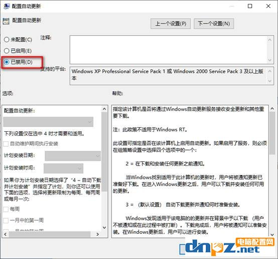

# win10禁止更新

### 一、禁用Windows Update服务
* 计算机 -> 右键 -> 属性 -> 服务和应用程序 -> 服务 -> 关闭 Windows Update 服务
  
  
  

### 二、在组策略里关闭Win10自动更新相关服务  
* 按下Win + R 组合快捷键打开运行命令操作框，然后输入“gpedit.msc”
* 在组策略编辑器中，依次展开 计算机配置 -> 管理模板 -> Windows组件 -> Windows更新
* 在右侧“配置自动更新”设置中，将其设置为“已禁用”
* 之后还需要再找到“删除使用所有Windows更新功能的访问权限”，选择已启用  
  
  
  
  

### 三、禁用任务计划里边的Win10自动更新
* 按下 Win + R 组合快捷键打开““运行”窗口，然后输入“taskschd.msc”
* 依次展开 任务计划程序库 -> Microsoft -> Windows -> WindowsUpdate，把里面的项目都设置为 [ 禁用 ] 就可以了。（我这里边只有一个任务，你的电脑里可能会有2个或者更多，全部禁用就行了）  
  
  
  

### 四、在注册表中关闭Win10自动更新
* 按下 Win + R 组合快捷键，然后输入 regedit
* 在注册表设置中，找到并定位到 [HKEY_LOCAL_MACHINE\SYSTEM\CurrentControlSet\Services\UsoSvc]。然后在右侧找到“Start”键
* 点击修改，把start值改成16进制，值改为“4”，然后点击「 确定 」保存数据，如图所示。
* 继续在右侧找到“FailureActions”键，右键点击修改该键的二进制数据，将“0010”、“0018”行的左起第5个数值由原来的“01”改为“00”，完成后，点击下方的“确定”即可  
  
  
  

### 五、关闭Windows更新  
  
  
 