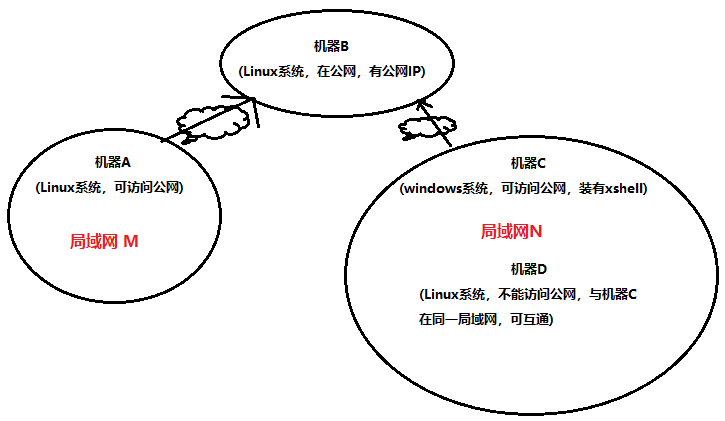

# 内网穿透-场景1
*  局域网M： 有机器A，Linux系统，可访问公网
* 公网机器： 有机器B，Linux系统，有公网IP或者域名
* 局域网N
    * 1) 有机器C，Windows系统，可访问公网，装有xshell
    * 2) 有机器D，Linux系统，不能访问公网，与机器C可以互通
#### 实现的效果，局域网M的机器A通过ssh直接访问机器D



#### 由始至终，都不需要在 机器B 和 机器D 执行任何配置命令
#### 步骤一： 机器C配置xshell隧道连接参数


* 上面配置的xshell参数，连接服务器时，连接的是机器B公网IP，应该输入机器B的账号密码
* 此时登录机器B，执行下面命令会登录机器D
```
ssh -p 转发端口 root@localhost   # 会登录到机器D
```

#### 步骤二： 机器A配置
* 新开一个tab页，输入下面命令
```
# ssh -p 机器B的ssh端口 机器B的登录账号@机器B的公网IP或者域名 -L 0.0.0.0:本地转发的端口:0.0.0.0:机器B的转发端口
ssh -p 22 root@www.taobao.com -L 0.0.0.0:35294:0.0.0.0:35294
# 输入机器B的密码
```

* 新开一个tab页，输入下面命令
```
# ssh -p 本地转发的端口 root@localhost #输入机器D的账号，会登录到机器D
ssh -p 35294 root@localhost
```