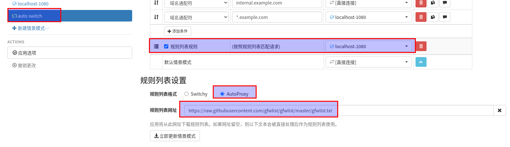

#### 网络代理的内容

**借助网络代理加速访问国外的网站**

> shadowsocks的server端搭建
```
docker run --restart always -itd --name ssserver -p 6443:6443 -p 端口udp-port:6500/udp mritd/shadowsocks:3.3.3-20191229 -m "ss-server" -s "-s 0.0.0.0 -p 6443 -m chacha20-ietf-poly1305 -k testchacha654321" -x -e "kcpserver" -k "-t 127.0.0.1:6443 -l :6500 -mode fast2"
```

> shadowsocks的client端安装
```
docker run --restart always -itd --name ssclient -p 1080:1080 mritd/shadowsocks:3.3.3-20191229 -m "ss-local" -s "-s 127.0.0.1 -p 6500 -b 0.0.0.0 -l 1080 -m chacha20-ietf-poly1305 -k testchacha654321" -x -e "kcpclient" -k "-r 服务器IP地址:端口udp-port -l :6500 -mode fast2"
```

#### git下载使用Socket5代理, 加速访问国外仓库
```
# 优先使用临时代理，亲测，好像该代理只对git命令生效，对curl命令不生效
ALL_PROXY=socks5://127.0.0.1:1080 git clone git@github.com:hegphegp/docker-learning.git  # 对git命令生效，没使用代理前，速度是20K/s以内，用了代理是 600K/s左右
ALL_PROXY=socks5://127.0.0.1:1080 git clone https://github.com/pkaq/ant-design-pro.git  # 对git命令生效，没使用代理前，速度是20K/s以内，用了代理是 600K/s左右
ALL_PROXY=socks5://127.0.0.1:1080 curl https://www.google.com/ # 对curl命令无效

# git全局配置socks5代理
# # git config --global http.proxy 'socks5://127.0.0.1:1080'
# # git config --global https.proxy 'socks5://127.0.0.1:1080'


# git清除socks5代理
# # git config --global --unset http.proxy
# # git config --global --unset https.proxy
```

* export ALL_PROXY=socks5://127.0.0.1:1080  代理只对当前 terminal 窗口有效，不影响其他 terminal 窗口


#### mvn命令配置网络代理打包
* ALL_PROXY=socks5://127.0.0.1:1080 mvn clean package  # 该代理的配置方式，对mvn命令打包好像没生效，没有走网络代理，下载依赖包的速度还是很慢
* mvn打包的最有效方式，先用阿里云maven仓库打包，再配置代理打包。如果一开始就用网络代理打包，下面的命令虽然配置网络代理忽略了maven.aliyun.com，但是还是很慢，无法忍受
* mvn clean package -DsocksProxyHost=127.0.0.1 -DsocksProxyPort=1080 的-DsocksProxyHost 和 -DsocksProxyPort 是亲测过，看到效果的，但是测不出-DsocksNonProxyHosts是否有效
```
# mvn命令的sock5代理
mvn clean package -Dmaven.test.skip=true -DsocksProxyHost=127.0.0.1 -DsocksProxyPort=1080
# mvn clean package -Dmaven.test.skip=true -DsocksProxyHost=127.0.0.1 -DsocksProxyPort=1080 -DsocksNonProxyHosts="maven.aliyun.com|maven.aliyun.com"

# mvn命令的http代理
mvn clean package -Dmaven.test.skip=true -DhttpProxyHost=127.0.0.1 -DhttpProxyPort=1080 
# mvn clean package -Dmaven.test.skip=true -DhttpProxyHost=127.0.0.1 -DhttpProxyPort=1080 -Dhttp.nonProxyHosts="maven.aliyun.com|maven.aliyun.com"

# mvn命令的https代理
mvn clean package -Dmaven.test.skip=true -DhttpsProxyHost=127.0.0.1 -DhttpsProxyPort=1080
# mvn clean package -Dmaven.test.skip=true -DhttpsProxyHost=127.0.0.1 -DhttpsProxyPort=1080 -Dhttps.nonProxyHosts="maven.aliyun.com|maven.aliyun.com"
```

#### gradle命令配置网络代理打包
* ALL_PROXY=socks5://127.0.0.1:1080 gradle clean build  # 该代理的配置方式，对gradle命令打包无效，没有走网络代理
* gradle打包的最有效方式，先用阿里云maven仓库打包，再配置代理打包。如果一开始就用网络代理打包，下面的命令虽然配置网络代理忽略了maven.aliyun.com，但是还是很慢，无法忍受
* gradle build -x test -DsocksProxyHost=127.0.0.1 -DsocksProxyPort=1080 的-DsocksProxyHost 和 -DsocksProxyPort 是亲测过，看到效果的，但是测不出-DsocksNonProxyHosts是否有效
```
# gradle命令的sock5代理
gradle build -x test -DsocksProxyHost=127.0.0.1 -DsocksProxyPort=1080
# gradle build -x test -DsocksProxyHost=127.0.0.1 -DsocksProxyPort=1080 -DsocksNonProxyHosts="maven.aliyun.com|maven.aliyun.com"

# gradle命令的http代理
gradle build -x test -DhttpProxyHost=127.0.0.1 -DhttpProxyPort=1080 
# gradle build -x test  -DhttpProxyHost=127.0.0.1 -DhttpProxyPort=1080 -Dhttp.nonProxyHosts="maven.aliyun.com|maven.aliyun.com"

# gradle命令的https代理
gradle build -x test -DhttpsProxyHost=127.0.0.1 -DhttpsProxyPort=1080
# gradle build -x test -DhttpsProxyHost=127.0.0.1 -DhttpsProxyPort=1080 -Dhttps.nonProxyHosts="maven.aliyun.com|maven.aliyun.com"
```

#### chrome浏览器安装SwitchyOmega插件，同时配置 auto switch 这个模式的的代理
* 规则列表网址https://raw.githubusercontent.com/gfwlist/gfwlist/master/gfwlist.txt  

  


#### squid正向代理(生产环境上不能访问互联网的服务器-->通过代理服务器-->访问互联网,下载安装软件)
* squid做代理时，第一次访问的时候，squid会把数据缓存到服务器上，当客户端第二次访问的时候，squid会对比文件的新旧，如果文件没有发生变化，则squid直接返回给用户数据，不需要在互联网上重新下载一份。缓存yum和apt-get的插件做软件仓库
* nginx自带的功能只支持 http 的正向代理，不支持https的正向代理，要非常麻烦地下载nginx插件，然后加入该模块，重新编译nginx
* squid自带的功能就支持 http 和 http 的正向代理
* yum可以在 /etc/yum.conf配置文件里面设置 proxy=http://ip:port 通过代理下载安装软件
* curl走代理下载文件  curl --proxy 10.36.72.18:3128 -o /etc/yum.repos.d/CentOS-Base.repo http://mirrors.aliyun.com/repo/Centos-7.repo

```
mkdir -p squid
cat > squid/squid.conf <<EOF
acl SSL_ports port 443
acl Safe_ports port 80      # http
acl Safe_ports port 21      # ftp
acl Safe_ports port 443     # https
acl Safe_ports port 70      # gopher
acl Safe_ports port 210	    # wais
acl Safe_ports port 1025-65535  # unregistered ports
acl Safe_ports port 280	    # http-mgmt
acl Safe_ports port 488     # gss-http
acl Safe_ports port 591     # filemaker
acl Safe_ports port 777     # multiling http
acl CONNECT method CONNECT
http_access allow !Safe_ports
http_access allow CONNECT !SSL_ports
http_access allow localhost manager
http_access allow manager
http_access allow localhost
http_port 3128
cache_dir ufs /var/spool/squid 100 16 256
coredump_dir /var/spool/squid
refresh_pattern ^ftp:     1440  20%  10080
refresh_pattern ^gopher:     1440  0%  1440
refresh_pattern -i (/cgi-bin/|\?)  0  0%  0
refresh_pattern (Release|Packages(.gz)*)$     0  20%  2880
refresh_pattern .     0  20%  4320


cache_mem 64 MB 
maximum_object_size 4 MB 
access_log /var/log/squid/access.log 
http_access allow all
EOF


docker run --name squid -itd --restart=always -p 23128:3128 -v `pwd`/squid/squid.conf:/etc/squid/squid.conf sameersbn/squid:3.5.27-2
# 查看日志 
curl -x localhost:3128 http://www.baidu.com
curl -x localhost:3128 https://www.baidu.com
curl -x localhost:3128 https://www.taobao.com
curl -x localhost:3128 https://www.taobao.com

curl --proxy localhost:3128 http://www.baidu.com
curl --proxy localhost:3128 https://www.baidu.com
curl --proxy localhost:3128 https://www.taobao.com
curl --proxy localhost:3128 https://www.taobao.com

docker exec -it squid cat /var/log/squid/access.log
```

### 使用squid的代理，抓取apt-get update的URL路径
```
echo "deb http://mirrors.aliyun.com/ubuntu/ $(lsb_release -cs) main restricted universe multiverse" > /etc/apt/sources.list
echo "deb http://mirrors.aliyun.com/ubuntu/ $(lsb_release -cs)-security main restricted universe multiverse" >> /etc/apt/sources.list
echo "deb http://mirrors.aliyun.com/ubuntu/ $(lsb_release -cs)-updates main restricted universe multiverse" >> /etc/apt/sources.list
echo "deb http://mirrors.aliyun.com/ubuntu/ $(lsb_release -cs)-proposed main restricted universe multiverse" >> /etc/apt/sources.list
echo "deb http://mirrors.aliyun.com/ubuntu/ $(lsb_release -cs)-backports main restricted universe multiverse" >> /etc/apt/sources.list
## 执行 apt-get update 后，访问的是下面的URL
apt-get -o Acquire::http::proxy="http://localhost:23128/" update
http://mirrors.aliyun.com/ubuntu/dists/bionic/InRelease
http://mirrors.aliyun.com/ubuntu/dists/bionic-security/InRelease
http://mirrors.aliyun.com/ubuntu/dists/bionic-updates/InRelease
http://mirrors.aliyun.com/ubuntu/dists/bionic-proposed/InRelease
http://mirrors.aliyun.com/ubuntu/dists/bionic-backports/InRelease

echo "deb [trusted=yes arch=amd64] http://172.17.0.1/bionic/nginx/ zesty main" > /etc/apt/sources.list.d/nginx.list
## 执行 apt-get update 后，访问的是下面的URL
http://172.17.0.1/bionic/nginx/dists/zesty/InRelease  
http://172.17.0.1/bionic/nginx/dists/zesty/Release 
http://172.17.0.1/bionic/nginx/dists/zesty/main/binary-amd64/Packages.gz 
http://172.17.0.1/bionic/nginx/dists/zesty/main/binary-all/Packages.gz 
http://172.17.0.1/bionic/nginx/dists/zesty/main/binary-all/Packages.xz 
http://172.17.0.1/bionic/nginx/dists/zesty/main/binary-all/Packages.bz2 
http://172.17.0.1/bionic/nginx/dists/zesty/main/binary-all/Packages.lzma 
http://172.17.0.1/bionic/nginx/dists/zesty/main/binary-all/Packages.lz4 
http://172.17.0.1/bionic/nginx/dists/zesty/main/binary-all/Packages.zst 
http://172.17.0.1/bionic/nginx/dists/zesty/main/binary-all/Packages 

```