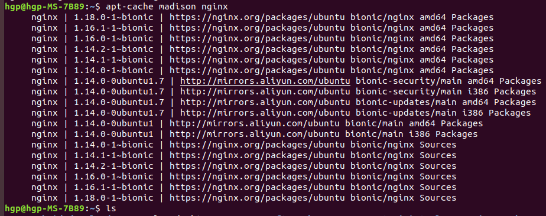

##### Ubuntu的软件离线安装包
* [参考博客 Ubunut上搭建本地源，做离线安装](https://www.jianshu.com/p/006d2885a8ca)
* 1) apt-cache madison 搜索软件版本列表
* 2) apt-cache depends 命令列出所有依赖包，包括祖父家依赖包
* 3) apt-get download 命令下载所有依赖包，包括祖父级的依赖包
* 4) dpkg-scanpackages 命令对下载的包建立建立索引

* *  不知道 apt-get download 指令是否会把32位或者64位的依赖包都下载下来，在Ubuntu的docker镜像里面，只下载了64位的依赖包，但是在自己的Ubuntu电脑执行，32位和64位的都下载了，把我搞蒙了

##### 添加nginx的仓库源
```
echo "deb [trusted=yes] https://nginx.org/packages/ubuntu/ $(lsb_release -cs) nginx" > /etc/apt/sources.list.d/nginx.list
echo "deb-src [trusted=yes] https://nginx.org/packages/ubuntu/ $(lsb_release -cs) nginx" >> /etc/apt/sources.list.d/nginx.list
# apt-key adv --keyserver keyserver.ubuntu.com --recv-keys ABF5BD827BD9BF62
apt-get update
```

##### apt-cache madison 搜索软件版本列表
```
apt-cache madison nginx
```
  

##### apt-cache depends 命令列出所有依赖包，包括祖父家依赖包
* apt-cache depends --recurse --no-recommends --no-suggests --no-conflicts --no-breaks --no-replaces --no-enhances 软件名=版本号
* apt-cache depends --recurse --no-recommends --no-suggests --no-conflicts --no-breaks --no-replaces --no-enhances 软件名=版本号 | grep "^\w"
* apt-cache depends --recurse --no-recommends --no-suggests --no-conflicts --no-breaks --no-replaces --no-enhances 软件名=版本号 | grep "^\w" | sort -u
```
apt-cache depends --recurse --no-recommends --no-suggests --no-conflicts --no-breaks --no-replaces --no-enhances nginx=1.18.0-1~bionic
apt-cache depends --recurse --no-recommends --no-suggests --no-conflicts --no-breaks --no-replaces --no-enhances nginx=1.18.0-1~bionic | grep "^\w"
apt-cache depends --recurse --no-recommends --no-suggests --no-conflicts --no-breaks --no-replaces --no-enhances nginx=1.18.0-1~bionic | grep "^\w" | sort -u

```
  

##### apt-get download 命令下载所有依赖包，包括祖父级的依赖包
* apt-get download $(apt-cache depends --recurse --no-recommends --no-suggests --no-conflicts --no-breaks --no-replaces --no-enhances 软件名=版本号 | grep "^\w")
```
apt-get download $(apt-cache depends --recurse --no-recommends --no-suggests --no-conflicts --no-breaks --no-replaces --no-enhances nginx=1.18.0-1~bionic | grep "^\w")
```


### 获取postgresql-11-citus的离线安装包
```
docker pull registry.cn-hangzhou.aliyuncs.com/hegp/ubuntu:18.04.5-20200807
docker tag registry.cn-hangzhou.aliyuncs.com/hegp/ubuntu:18.04.5-20200807 ubuntu:18.04.5-20200807
docker rmi registry.cn-hangzhou.aliyuncs.com/hegp/ubuntu:18.04.5-20200807
docker run --privileged -itd --restart always -v /sys/fs/cgroup:/sys/fs/cgroup:ro -v /opt/soft/repository/ubuntu-18:/repository --name ubuntu-18 ubuntu:18.04.5-20200807 /sbin/init
docker exec -it ubuntu-18 bash
echo "deb [trusted=yes] http://apt.postgresql.org/pub/repos/apt $(lsb_release -cs)-pgdg main" > /etc/apt/sources.list.d/pgdg.list
apt-get update
# apt-cache madison postgresql-12
apt-cache madison postgresql-11
# apt-cache madison postgresql-10
# apt-cache madison postgresql-9.6
# apt-cache madison postgresql-9.5
# apt install postgresql-10 postgresql-10-postgis-3-scripts postgis postgresql-10-citus
# 在20201011 18:04:00时刻，postgresql-12-citus版本还没发布，只有postgresql-11-citus版本
apt-cache madison postgresql-11-citus

cd /repository
apt-get download $(apt-cache depends --recurse --no-recommends --no-suggests --no-conflicts --no-breaks --no-replaces --no-enhances postgresql-11=11.9-1.pgdg18.04+1 | grep "^\w")
apt-get download $(apt-cache depends --recurse --no-recommends --no-suggests --no-conflicts --no-breaks --no-replaces --no-enhances postgresql-11-citus=8.0.0.PGDG-2.pgdg18.04+1 | grep "^\w")

exit

```